import Image from 'next/image'

# Kakhovka Dam Breach

  Assembled by [Kos Palchyk](https://twitter.com/kddsky)  
  This is a living document,  
  please @ me on twitter to add something  
  I’m not an expert on dams  
  [#StandWithUkraine](https://twitter.com/hashtag/StandWithUkraine) [#RussiaIsATerroristState](https://twitter.com/hashtag/RussiaIsATerroristState)

## Preface

On February 24th, 2022 russia occupied Kakhovka dam.  
On June 6th, 2023 Kakhovka dam was breached.

  Illustration author: [Andrew Barr](https://twitter.com/andrew_barr)  
  source: [https://twitter.com/andrew\_barr/status/1668979717989335042](https://twitter.com/andrew_barr/status/1668979717989335042) 

## Summary

Currently widely accepted version of dam breach is that it was blown up. In this document I want to show that currently our evidence of explosion is not sufficient enough, and that there are signs of progressing riverbed [scouring](#h.29ubume3qjln) & washout for at least 38 days before the breach, which could lead to dam collapse on June 6th. Mismanaging critical infrastructure can be as dangerous as putting explosives on it, and there’s good evidence that the dam was intentionally or unintentionally ill-maintained during the russian occupation.

But let me step back a little first. Since late 2016 till russian occupation of the dam in Feb 2022, there was only one visible from satellites water drainage in Spring floods of 2018, which lasted for at most 18 days:

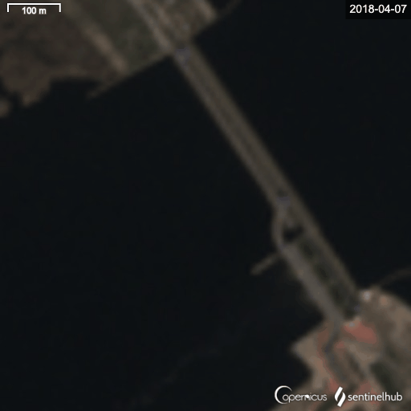

Source: [https://sentinelshare.page.link/SzuZ](https://sentinelshare.page.link/SzuZ)

Gate opening happened when HPP turbines didn’t spend enough water during Spring floods. Opening of the sluice gates is not a rare thing, but doesn’t happen often either. In this case gate opening was done in phases, according to existing water load on Kakhovka reservoir. It was ratified by a specialized committee, and even got to the UkrHydroEnergo news: [gates opening in 2018](#h.468t3rke3wnt). Note that the gates were opened in a symmetrical to each other and to the HPP layout. Meaning that right-bank and left-bank gates are opened symmetrically. First [2 + HPP](#h.ywky1q8g0imv), then [2 + 2 + HPP](#h.y9b61ur3sbro), then [4 + 2 + HPP](#h.ig4oqd4kk9lk).

Since russian occupation of the dam, there were two massive drainages through the gates:

1\. At least 45 days in May-June 2022:

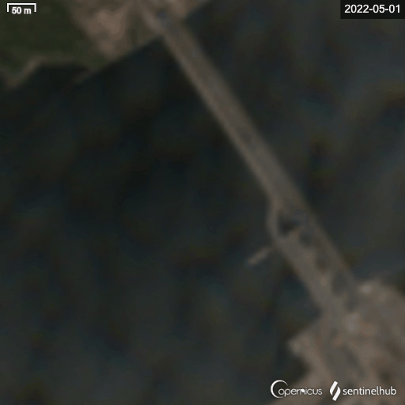

Source: [https://sentinelshare.page.link/rxDu](https://sentinelshare.page.link/rxDu)

This drainage is done when what’s left of the original HPP crew is still allowed to the dam. They will be denied access around September-October.

2\. And then 8 months of almost continuous drainage from October till dam breach in June, last 7 months of which (235 days) is uninterrupted drainage through gates on just one side, near the HPP. On the same side, where the June 2023 breach will happen:

Source: [https://sentinelshare.page.link/tt29](https://sentinelshare.page.link/tt29)

During this period the drainage happens only on one side of the river, near the HPP. There’s no symmetry in the opened gates. There’s no open-closed-open pattern of the gates that we often see [during drainages](#h.181sp7yhqstj). Gates #1, #3, #5, #6, #7 are opened together with HPP gates for 235 days straight.

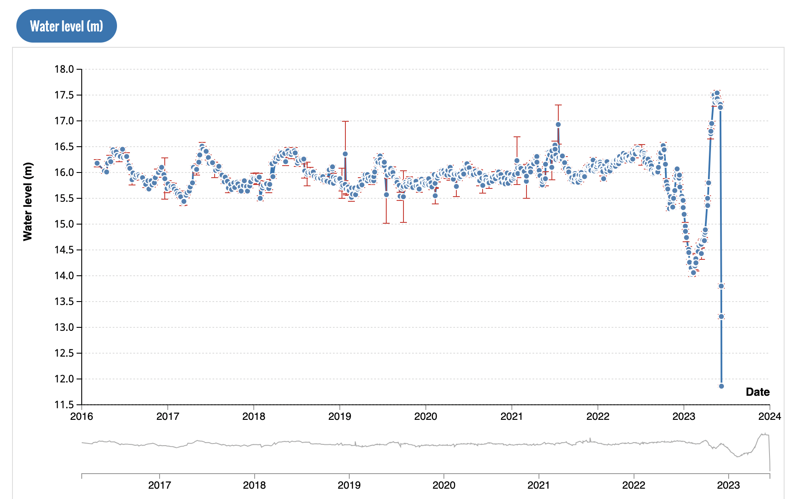

Source: [Kakhovka reservoir water levels (2016-2023)](#h.nmngj2me8xqo)

This continuous uncontrolled drainage led to critical Kakhovka reservoir water levels, first to [record low](#h.ujenstc203g0) in winter time (when Dnipro has less water income), and then to [record high](#h.4clzhql7mptd) during spring floods (when rains and melting snow bring a lot of water to Dnipro). The five constantly opened gates gave first too much and then too little water.

Constant drainage and big water level difference in Spring likely lead to river bed scouring, first indication of which we see on [28 April 2023 — part of the wall separating HPP & dam breaks](#h.2kn7qrssjcjt):

Source: [https://youtu.be/6XNV9QfHm54?t=20](https://youtu.be/6XNV9QfHm54?t=20)

Signs of riverbed scour continue with [a collapse of the s-bridge early in June](#h.ocek4il4hg9l), 4 and 3 days before the dam breach:

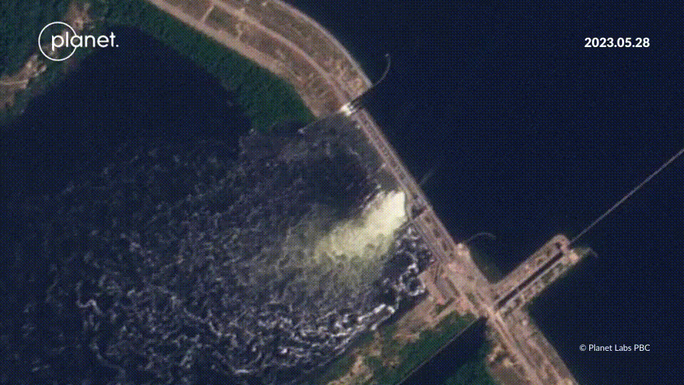

Source: [https://twitter.com/i/status/1665974703935180801](https://twitter.com/i/status/1665974703935180801) 

Actually river bed scouring already happened when the dam was under construction in the 1950's: [K-Dam river bed was already scoured once](#h.ptasfgmuswer). A flood occurred during the construction of the dam. This forced engineers to drain water through gates on one side of the dam, while water level downstream of the dam was 2 meters below normal. That led to river bed scouring / washout just downstream from rysberma for 9m deep. ([rysberma](#h.gocvqmiqkt2w) is a protective riverbed layer downstream from the dam)

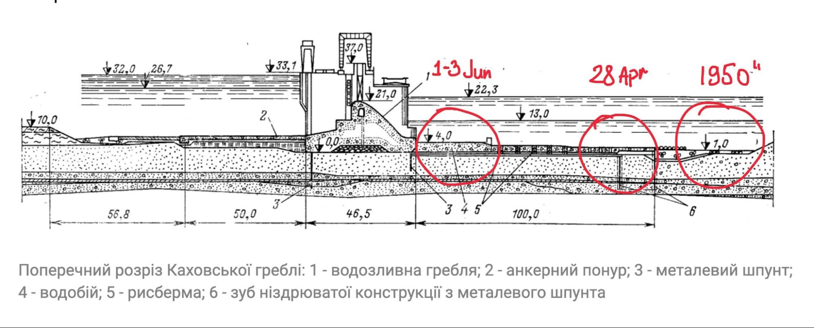

Source: see [blueprints](#h.gocvqmiqkt2w)

So we had riverbed scouring in the 1950's, in a similar situation, some 100+ meters downstream (disclaimer: I bet it got fixed then, I reference it only as a similar case). Then we have the separator wall collapse on [28 April 2023](#h.2kn7qrssjcjt), 38 days before the breach, some 100 meters downstream from the barrage. Then we have the bridge foundations collapse on [1-2 and 2-3 of June 2023](#h.ocek4il4hg9l), 4 and 3 days before the catastrophe, right at the base of the barrage.

Progressing upstream river bed scouring could undermine the basis of the barrage and the HPP structures. Which could cause them to collapse under their own weight and water pressure from the reservoir, leading to the dam breach on [6th of June, 2023](#h.p5cr7zq0cgek):

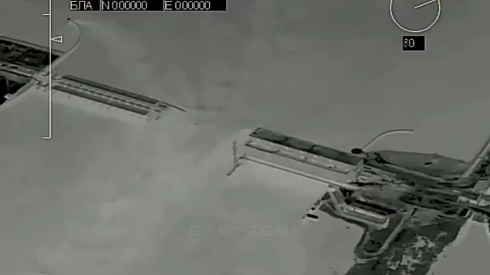

Source: [https://t.me/grey\_zone/19067](https://t.me/grey_zone/19067)

This evidence cannot rule out possible intentional explosive demolition of the dam by russians on 06 June 2023, or accidental explosions on the dam that would speed up dam destruction. But it seems like russian mismanagement of the dam could lead to the dam breach on its own.

## What is that scouring that you keep mentioning?

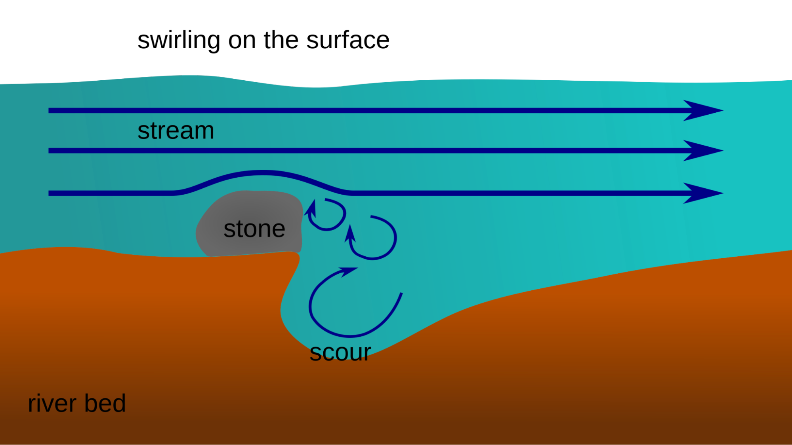

\> Hydrodynamic scour is the removal of sediment such as silt, sand and gravel from around the base of obstructions to the flow in the sea, rivers and canals. Scour, caused by fast flowing water, can carve out scour holes, compromising the integrity of a structure.

Source: [https://en.wikipedia.org/wiki/Hydrodynamic\_scour](https://en.wikipedia.org/wiki/Hydrodynamic_scour)

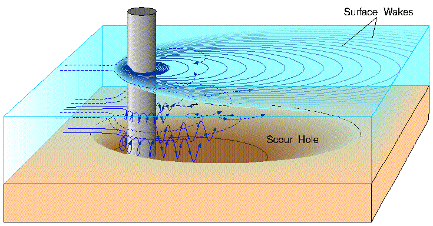

\> It is a notable cause of [bridge failure](https://en.wikipedia.org/wiki/Bridge_scour) and a problem with most marine structures supported by the seabed in areas of significant [tidal](https://en.wikipedia.org/wiki/Tidal_scour) and ocean current.

\> It has been estimated that 60% of all bridge failures result from scour and other hydraulic-related causes.

Source: [https://en.wikipedia.org/wiki/Bridge\_scour](https://en.wikipedia.org/wiki/Bridge_scour)

According to [these posts by UkrHydroElectro](#h.468t3rke3wnt) from 2018 — one gate roughly drains 100 cubic meters of water per second. Let’s take that at least since 02 January 2023 three gates are fully opened and two are half-opened. And let’s ignore overdrainage and overtopping for simplicity, we’ll say that they cancel each other out. That means we have roughly 400 cubic meters of water drained each second. Giving us roughly 5\_356\_800\_000 cubic meters drained, if only counting the last 5 months before the breach. And we’re even not counting the opened gates on the HPP.

## Does it mean that the dam broke on its own?

No. If someone leaves a stove on for long, and the house catches fire — we don’t say “the house burned down on its own”. It is arson.

Albeit being monumental and robust, dams require professional maintenance and precise manipulation. And they can fail for a variety of reasons: [https://en.wikipedia.org/wiki/Dam\_failure](https://en.wikipedia.org/wiki/Dam_failure), including poor maintenance.

## What about the evidence of an explosion?

Well, currently evidence of an explosion is unverifiable and contradictory. It doesn’t mean that there were no explosions. It only means that our evidence for the explosion demolition version is not enough. See this section for more: [Explosion theory evidence and critics](#h.m7slhv9vp1qe)

## So russia did it by explosives or by ill-maintaining, does it really matter which way?

It doesn’t matter for russia — they are guilty either way and should face the consequences. But for the world it is important to learn how exactly the breach happened, and how we can prevent similar disasters in the future.

If some terrorists want to blow up a hazardous infrastructure that they captured — there’s little we can do. We had to act before, not letting terrorists into the place. But if this disaster happened by knowing or unknowing mis-maintenance — then the world could foresee this catastrophe and intervene with social, political, economic and raw force months before the breach. Actually, the OSINT community has been warning the world about possible catastrophe, but our existing international institutions could not or would not prevent the disaster.

If this evidence of scouring / washout indeed was sufficient to cause the dam breach — then russia should’ve noticed the breaking structures at least 38 days before the breach. Thus before we prove explosion or erosion, we already have a case of criminal inaction.

May I also remind you: aside from many suffering cities and villages, russia also currently occupies the  [Zaporizhzhia Nuclear Power Plant](https://en.wikipedia.org/wiki/Zaporizhzhia_Nuclear_Power_Plant).

Read further to learn more about the dam, see a detailed timeline of the events, and explore why the explosion version doesn’t have enough evidence.

{/* ## Table of contents:

[Photos](#h.iar42vryl8jl)

[Blueprints](#h.gocvqmiqkt2w)

[~](#h.7oh2p927lzf2)

[Timeline](#h.oqnpz1eob2be)

[Feb-Jul 2022](#h.kto4wli31sir)

[26 Feb 2022 (right after full-blown invasion)](#h.gclp45xm5iy9)

[~](#h.brs06f2nxu2f)

[Shipping lock](#h.liyykxh467kw)

[August 2022](#h.r3von5elokd2)

[~ 10 August 2022](#h.aqfpfbavipqf)

[~](#h.njc7qnxmn4x7)

[13 August 2022 — russian propaganda reports no critical damage to the dam](#h.jv3pjolxxrlq)

[September 2022](#h.qwynlh3xncn3)

[02 September 2022](#h.lyjb6ziv8azz)

[06 September 2022 — 4 out of 6 HPP turbines are working](#h.gfso0ag6pegh)

[September-October 2022 — regular HPP crew is not allowed to the dam](#h.nm5adoi2zm10)

[Date unknown — sluice gates #1 are damaged](#h.cp125ng2vctk)

[~](#h.6z1tci4m2hsm)

[~](#h.x3p7lzngd484)

[~](#h.ihn08dfpt3kf)

[October 2022](#h.6koxmh8io91u)

[01 October 2022 — unverified: possibly leaking sluice gate #1](#h.6umq3ebsaoj)

[18 October 2022](#h.n5ddwwc4har)

[02 November 2022 — unverified: possibly leaking sluice gate #1](#h.fpzr9akcc5zb)

[10 November 2022 — opened gates #23](#h.bglxkspisbn9)

[11 November 2022 — russians leave the right bank & blow up road sections](#h.pj4uqvu41jm4)

[Nighttime (probably):](#h.ahyoe4vvrv8)

[Daytime, 10:25 in the morning](#h.41enp935qi1v)

[Damaged part from aside](#h.1bl0dl8rct1)

[Close-up photo of the damaged part, from 29 June 2022 (after the breach)](#h.i51c4vfrf8u)

[13 November 2022](#h.3t4z7t8d08so)

[15 November 2022](#h.vms9qqhya9lq)

[01 January 2023](#h.7h4fzi6h4fc)

[02 January 2023](#h.b6zi4bcvyd46)

[19 February 2023](#h.klrywxyxzjhx)

[01 March 2023 — low water levels in Kakhovka Reservoir due to constant drainage](#h.dg832ekc5fes)

[5 March 2023 — date unconfirmed — close-ups of dam/hpp damage](#h.gaipntgt02zh)

[~](#h.10wcgmbctvvs)

[11 March 2023 — water drainage, HPP crane destroyed](#h.ogir8kreukje)

[24 March 2023 — UkrHydroEnergo: russian gate management doesn’t make sense](#h.ujenstc203g0)

[16 April - 4 May 2023 — first signs of overtopping](#h.4clzhql7mptd)

[Sidenote: analysis of the reservoir water management and gates operation](#h.zefeeu1clmzi)

[Dam gates state & management](#h.ivgywrhri053)

[HPP gates state & management](#h.wuxr72dt43ln)

[Feb - Jun — Extreme drainage and overtopping](#h.xm1htma6envx)

[Kakhovka reservoir water levels (2016-2023)](#h.nmngj2me8xqo)

[28 April 2023 — part of the wall separating HPP & dam breaks](#h.2kn7qrssjcjt)

[My speculations on how it happened and what this means](#h.j7mnyn6pglt4)

[Sidenote on stream direction](#h.1ewm5wz6dq7j)

[More speculations on the wall foundation](#h.8p22ocprt9w0)

[K-Dam river bed was already scoured / washed out once in 1950s](#h.ptasfgmuswer)

[3 May 2023 — Overtopping](#h.ch1u0w5sjsxh)

[16 May 2023 — overtopping](#h.6e2hq1c6jwcx)

[28 May 2023](#h.mamzkiespkql)

[31 May 2023 — russian legislation not to investigate accidents](#h.ysfne1p6c5iy)

[1-2 June & 2-3 June 2023 — overtopping & fall of the s-bridge](#h.ocek4il4hg9l)

[Overtopping and falling sections of s-bridge](#h.2lezv2hknsb1)

[~](#h.rytmv5kr7slt)

[~](#h.m7s5rbhh5yll)

[Kos: Analysis of the s-bridge foundation](#h.5j24tyemnyf4)

[6 June 2023 — Breach](#h.p5cr7zq0cgek)

[2:18 — local chats report explosions](#h.im6nwgkavv90)

[~ 02:46](#h.3pdog15p5mzi)

[The HPP starts to break](#h.s31ba3kp4c4k)

[Morning](#h.7j3py8ciswo0)

[~](#h.ok4giijco7o9)

[~](#h.eo3os7aqxed9)

[~](#h.taxqvmdx3cqf)

[~](#h.4kqn8psk48ox)

[~](#h.i4ap693dgyle)

[~ 7:00 (unverified time)](#h.9exo4n42ozfm)

[~ 7:18 (unverified time)](#h.xfkm3rvy94u5)

[~](#h.ciysw4mlj571)

[~](#h.1e7g7pahmqq)

[~](#h.fh3e1gsjo3g4)

[8 June 2023](#h.yy37abfnhlqq)

[~](#h.ew32n7ju4ami)

[10 June 2023](#h.464dgnmicigk)

[16 June 2023](#h.pp7qpisugv0r)

[23 June 2023](#h.u8w7e7uq18km)

[~](#h.x8oyitx76lrq)

[27 June 2023](#h.ly2aqumx672e)

[29 June 2023](#h.d9bl0tqb1mfr)

[Explosion theory evidence and critics](#h.m7slhv9vp1qe)

[NYT article on barrage explosive demolition](#h.xsxd8j63ook3)

[В статті не береться до уваги що є всі ознаки прогресуючої ерозії основи греблі](#h.qufoppiajhsc)

[Затоплення частини водозливної греблі](#h.4anew5xzozct)

[Satellite detecting explosions at or near the dam](#h.u3b3ovfmy6yd)

[Seismic activity](#h.r9o5g0s1n98y)

[Car with explosives on the dam](#h.gr1x50x519sp)

[Allegedly intercepted russian transmission near the dam, around the time of the breach](#h.9iujzs4fmuz8)

[Andrew Barr’s thread on Kakhovka Dam](#h.numvsj64npu6)

[Consequences](#h.fjuqlfmkejd0)

[Appendix](#h.15bo8tg4v9ra)

[Useful links](#h.nc6e2zwf4cq2)

[Other materials](#h.jmzkrvfyaivx)

[Dam drone footage before the war, upstream](#h.klopp5ulnc73)

[Brigade fixing road over the lock < Jul 2022](#h.3orvcohp1c2j)

[~ 10 Aug 2022](#h.tjyfept3hhhl)

[Sep 02 confirmation of Lock and s-bridge hits](#h.vkf7q7o5lxy6)

[02 Sep 2022 — Lock bridge damage](#h.7w0ncr7pgykg)

[Reference photos](#h.t58jy85vepkf)

[2020-06-05 .. 2023-06-28 Gif](#h.wjra68wjxgfk)

[Open gates ~ 2013](#h.181sp7yhqstj)

[Gates opening in 2018](#h.468t3rke3wnt)

[10-04-2018 — Two opened + HPP](#h.ywky1q8g0imv)

[11-04-2018 — 4 opened + HPP](#h.y9b61ur3sbro)

[14 April 2018 — 6 opened + HPP](#h.ig4oqd4kk9lk)

[HPP from upstream](#h.paj250j11086)

[HPP from left bank, upstream](#h.veu1uzgnb87c)

[HPP crane other side](#h.6mwcgjkzr4ln)

[~](#h.13klwv68hvf1)

[Cranes up-close](#h.hzoj7bxzuwdl)

[russian positions on the dam](#h.3zgzoab6z95t)

[Names](#h.vkdmbt8sn3s9)

[Photos from the site](#h.5fev40apyhmj)

[17 Aug 2022](#h.qntlfwnd6w2h)

[Position on the bottom of the river — unconfirmed](#h.ugenxc6oordc)

[25 March 2022 — inside HPP](#h.a5i15ltsvfeb)

[Historic photos](#h.5d8vz3hyfjhy)

[Waterspill barrage and apron](#h.re6spt96lw8b)

[Barrage and stilling basin](#h.g4ibb6qftw05)

[Stilling basin and the separator-wall](#h.k6c4o8q78v8c) */}

Photos
------

← right bank, embankment dam, barrage, HPP, Lock, left bank →

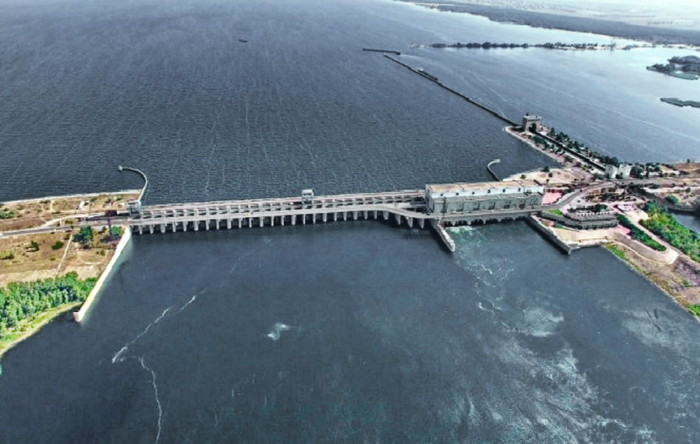

Source: [https://en.defence-ua.com/media/illustration/articles/82063286aa051fa9.jpg](https://en.defence-ua.com/media/illustration/articles/82063286aa051fa9.jpg)

Source: [https://www.google.com/maps/@46.7782633,33.3735299,4109a,35y,56.5h/data=!3m1!1e3?entry=ttu](https://www.google.com/maps/@46.7782633,33.3735299,4109a,35y,56.5h/data=!3m1!1e3?entry=ttu) 

Blueprints
----------

Поперечний розріз Каховської греблі: 1 - водозливна гребля; 2 - анкерний понур; 3 - металевий шпунт; 4 - водобій; 5 - рисберма; 6 - зуб ніздрюватої конструкції з металевого шпунта

Поперечний розріз Каховської ГЕС: 1 - фундаментна плита; 2 - металевий шпунт; 3 - донний водоскид; 4 - залізобетонний міст

Source: [https://defence-ua.com/army\_and\_war/v\_ukrgidroenergo\_rozpovili\_jak\_rashisti\_tsilesprjamovano\_pidirvali\_kahovsku\_ges\_za\_najgirshim\_variantom-11812.html](https://defence-ua.com/army_and_war/v_ukrgidroenergo_rozpovili_jak_rashisti_tsilesprjamovano_pidirvali_kahovsku_ges_za_najgirshim_variantom-11812.html#:~:text=%D0%9F%D0%BE%D0%BF%D0%B5%D1%80%D0%B5%D1%87%D0%BD%D0%B8%D0%B9%20%D1%80%D0%BE%D0%B7%D1%80%D1%96%D0%B7%20%D0%9A%D0%B0%D1%85%D0%BE%D0%B2%D1%81%D1%8C%D0%BA%D0%BE%D1%97%20%D0%B3%D1%80%D0%B5%D0%B1%D0%BB%D1%96%3A%201%20%2D%20%D0%B2%D0%BE%D0%B4%D0%BE%D0%B7%D0%BB%D0%B8%D0%B2%D0%BD%D0%B0%20%D0%B3%D1%80%D0%B5%D0%B1%D0%BB%D1%8F%3B%202%20%2D%20%D0%B0%D0%BD%D0%BA%D0%B5%D1%80%D0%BD%D0%B8%D0%B9%20%D0%BF%D0%BE%D0%BD%D1%83%D1%80%3B%203%20%2D%20%D0%BC%D0%B5%D1%82%D0%B0%D0%BB%D0%B5%D0%B2%D0%B8%D0%B9%20%D1%88%D0%BF%D1%83%D0%BD%D1%82%3B%204%20%2D%20%D0%B2%D0%BE%D0%B4%D0%BE%D0%B1%D1%96%D0%B9%3B%205%20%2D%20%D1%80%D0%B8%D1%81%D0%B1%D0%B5%D1%80%D0%BC%D0%B0%3B%206%20%2D%20%D0%B7%D1%83%D0%B1%20%D0%BD%D1%96%D0%B7%D0%B4%D1%80%D1%8E%D0%B2%D0%B0%D1%82%D0%BE%D1%97%20%D0%BA%D0%BE%D0%BD%D1%81%D1%82%D1%80%D1%83%D0%BA%D1%86%D1%96%D1%97%20%D0%B7%20%D0%BC%D0%B5%D1%82%D0%B0%D0%BB%D0%B5%D0%B2%D0%BE%D0%B3%D0%BE%20%D1%88%D0%BF%D1%83%D0%BD%D1%82%D0%B0)

Lower quality: [http://energetika.in.ua/ua/books/book-3/part-2/section-4/4-3-grebli-gidrovuzliv](http://energetika.in.ua/ua/books/book-3/part-2/section-4/4-3-grebli-gidrovuzliv#:~:text=%D0%9C%D0%B0%D0%BB.%204.36.%20%D0%92%D0%BE%D0%B4%D0%BE%D0%B7%D0%BB%D0%B8%D0%B2%D0%BD%D0%B0%20%D0%B3%D1%80%D0%B5%D0%B1%D0%BB%D1%8F%20%D0%9A%D0%B0%D1%85%D0%BE%D0%B2%D1%81%D1%8C%D0%BA%D0%BE%D1%97%20%D0%93%D0%95%D0%A1%20%D0%BD%D0%B0%20%D0%BC%D1%96%D0%BB%D0%BA%D0%BE%D0%BF%D1%96%D1%89%D0%B0%D0%BD%D1%96%D0%B9%20%D0%BE%D1%81%D0%BD%D0%BE%D0%B2%D1%96.%20%D0%9F%D0%BE%D0%BF%D0%B5%D1%80%D0%B5%D1%87%D0%BD%D0%B8%D0%B9%20%D1%80%D0%BE%D0%B7%D1%80%D1%96%D0%B7%3A%201%20%E2%80%93%20%D0%B2%D0%BE%D0%B4%D0%BE%D0%B7%D0%BB%D0%B8%D0%B2%D0%BD%D0%B0%20%D0%B3%D1%80%D0%B5%D0%B1%D0%BB%D1%8F%3B%202%20%E2%80%93%20%D0%B0%D0%BD%D0%BA%D0%B5%D1%80%D0%BD%D0%B8%D0%B9%20%D0%BF%D0%BE%D0%BD%D1%83%D1%80%3B%203%20%E2%80%93%20%D0%BC%D0%B5%D1%82%D0%B0%D0%BB%D0%B5%D0%B2%D0%B8%D0%B9%20%D1%88%D0%BF%D1%83%D0%BD%D1%82%3B%204%20%E2%80%93%20%D0%B2%D0%BE%D0%B4%D0%BE%D0%B1%D1%96%D0%B9%3B%205%20%E2%80%93%20%D1%80%D0%B8%D1%81%D0%B1%D0%B5%D1%80%D0%BC%D0%B0%3B%206%20%E2%80%93%20%D0%B7%D1%83%D0%B1%20%D0%BD%D1%96%D0%B7%D0%B4%D1%80%D1%8E%D0%B2%D0%B0%D1%82%D0%BE%D1%97%20%D0%BA%D0%BE%D0%BD%D1%81%D1%82%D1%80%D1%83%D0%BA%D1%86%D1%96%D1%97%20%D0%B7%20%D0%BC%D0%B5%D1%82%D0%B0%D0%BB%D0%B5%D0%B2%D0%BE%D0%B3%D0%BE%20%D1%88%D0%BF%D1%83%D0%BD%D1%82%D0%B0)

### ~

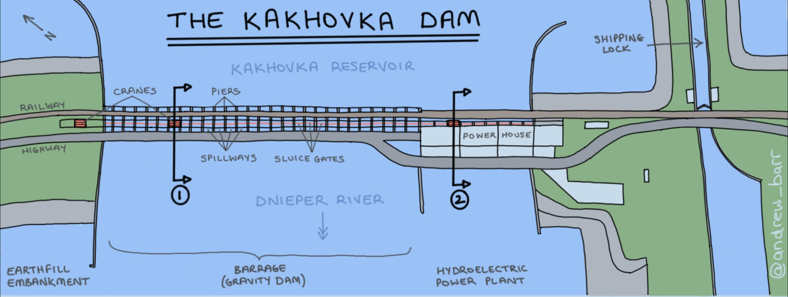

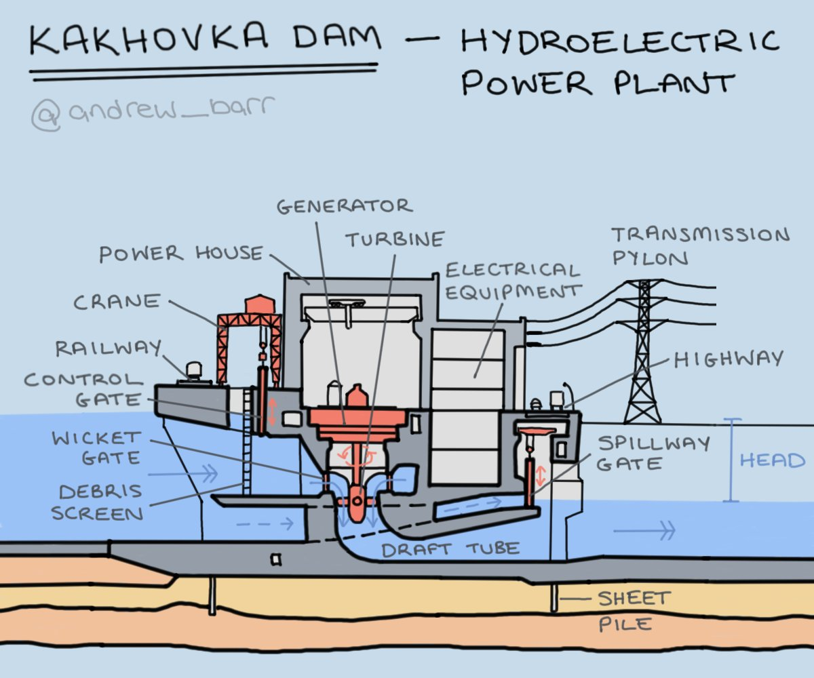

Illustrations author: [Andrew Barr](https://twitter.com/andrew_barr)

Source: [https://twitter.com/andrew\_barr/status/1668979717989335042](https://twitter.com/andrew_barr/status/1668979717989335042) 

Timeline
--------

Disclaimer on the date-time stamps: while satellite timestamps can be trusted, news and individual uploads exact date-time is often hard to verify. Most of the dates here should be read as “not later than”.

### Feb-Jul 2022

From the very start of the massive invasion russia used HPP as their stronghold, gunpoint / artillery position.

#### 26 Feb 2022 (right after full-blown invasion)

​​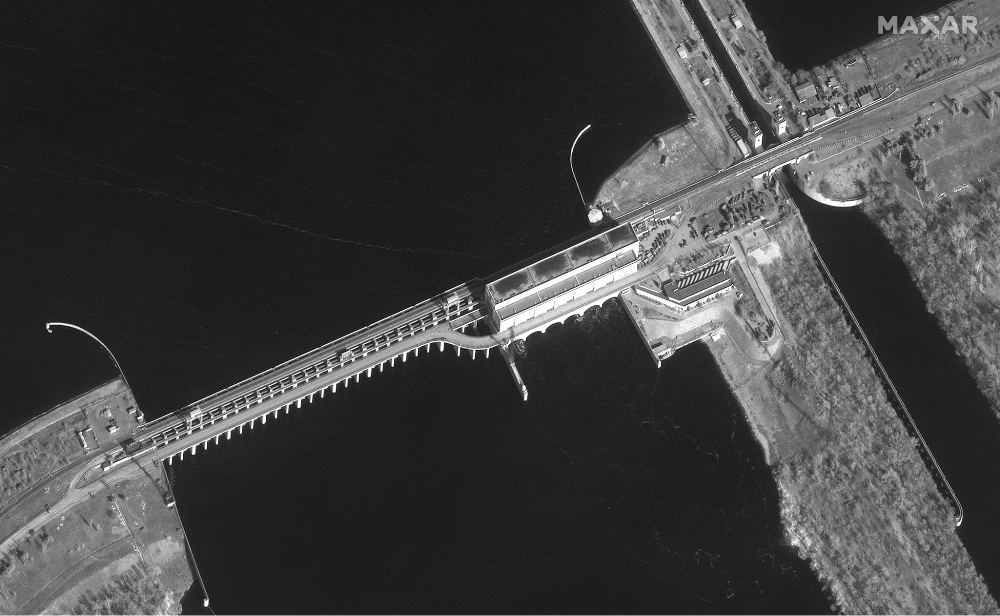

Source: [https://twitter.com/DefTechPat/status/1497664117557149700/photo/1](https://twitter.com/DefTechPat/status/1497664117557149700/photo/1) 

High res: [https://nypost.com/2022/10/20/russia-planning-false-flag-attack-to-blow-up-kherson-dam/](https://nypost.com/2022/10/20/russia-planning-false-flag-attack-to-blow-up-kherson-dam/) 

#### ~

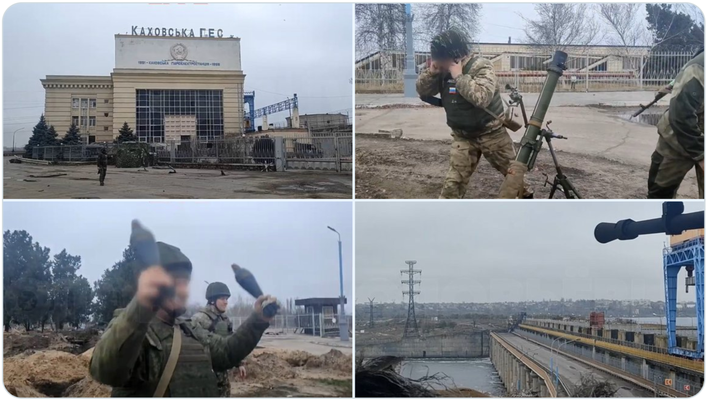

Source: [https://twitter.com/PerEkstrom1/status/1598273815670575104](https://twitter.com/PerEkstrom1/status/1598273815670575104)

Source: [https://twitter.com/osintjourno/status/1672917019694358529](https://twitter.com/osintjourno/status/1672917019694358529) 

More russian positions on the dam/hpp below: [ru positions on the dam](#h.3zgzoab6z95t)

#### Shipping lock

The shipping lock channel is close to the Dam/HPP. Ukraine has been hitting the bridges over the lock and russian positions near the lock since around Summer 2022. Russia has dumped gravel into the lock channel around October 2022. As a result the lock became inoperable. I won’t be covering these events in this document, giving this as a background.

Source: [https://twitter.com/ArtisanalAPT/status/1580049554618994688](https://twitter.com/ArtisanalAPT/status/1580049554618994688)

### August 2022

#### ~ 10 August 2022

Ukraine does a strike on the s-bridge near the HPP

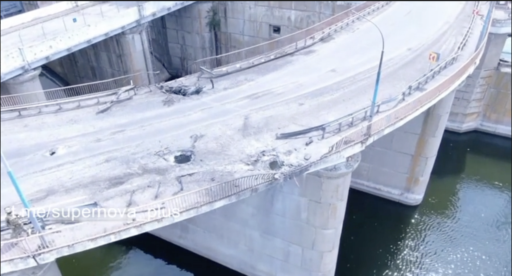

Source: [https://t.me/supernova\_plus/8736](https://t.me/supernova_plus/8736)

Notes:

1.  It seems like gates #1 are intact  
    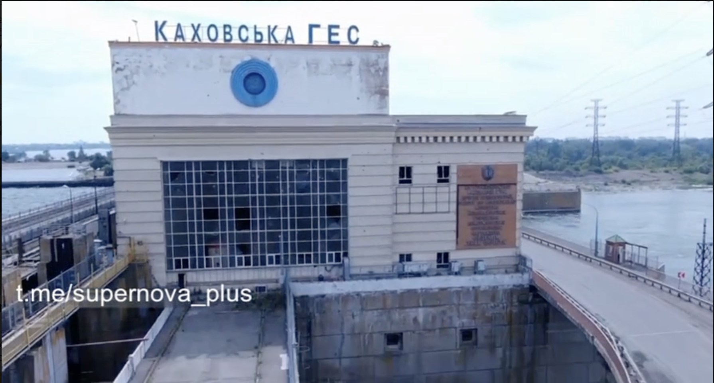

##### ~

Source: [https://www.youtube.com/watch?v=JDEKUJ7EfN8](https://www.youtube.com/watch?v=JDEKUJ7EfN8)

Source: [https://www.youtube.com/watch?v=HiXpVpwpO14](https://www.youtube.com/watch?v=HiXpVpwpO14)

Source: Ху@вий Херсон (TODO: find the source)

#### 13 August 2022 — russian propaganda reports no critical damage to the dam

Probably the gates #1 are intact at this moment, as only “broken glass” damage is reported by the HPP worker.

Video source: [https://t.me/tass\_agency/150855](https://t.me/tass_agency/150855) 

### September 2022

#### 02 September 2022

Satellite confirmation of s-bridge hits from 02 September

Source: [https://twitter.com/ArtisanalAPT/status/1567270449226072066](https://twitter.com/ArtisanalAPT/status/1567270449226072066)

#### 06 September 2022 — 4 out of 6 HPP turbines are working

UkrHydroEnergo news article claims that on 06 September 2022 two of the six turbines are under maintenance, and other four are working.

Source: [https://uhe.gov.ua/media\_tsentr/novyny/kakhovska-ges-pracyuyut-chotiri-z-shesti-agregativ](https://uhe.gov.ua/media_tsentr/novyny/kakhovska-ges-pracyuyut-chotiri-z-shesti-agregativ) 

#### September-October 2022 — regular HPP crew is not allowed to the dam

\> За словами генерального директора ПрАТ «Укргідроенерго» Ігоря Сироти, з вересня 2022 року захоплена [Каховська ГЕС не працює](https://e-b.com.ua/igor-sirota-do-viini-u-nas-bula-strategiya-rozvitku-a-teper-u-nas-strategiya-vidnovlennya-5406) і використовується окупантами виключно як фортифікаційна споруда. Водночас росіяни підняли затвори на ГЕС і скидають там воду.

Source: [https://investigator.org.ua/ua/news-2/254079/](https://investigator.org.ua/ua/news-2/254079/)

\> Наші співробітники, ризикуючи своїм життям, виконували професійні обов’язки. Гідно пройшли водопілля навесні 2022 року, працювали на станції та підтримували обладнання в належному стані. З жовтня окупанти перестали допускати українських працівників до управління гідроелектростанцією та на її територію.

Source: [https://uhe.gov.ua/media\_tsentr/novyny/nova-kakhovka-ce-ukraina](https://uhe.gov.ua/media_tsentr/novyny/nova-kakhovka-ce-ukraina)

### Date unknown — sluice gates #1 are damaged

First sluice gates and rails above it were damaged after 02 Sep 2022, exact date, what caused the damage and if the barrage is damaged — is unclear.

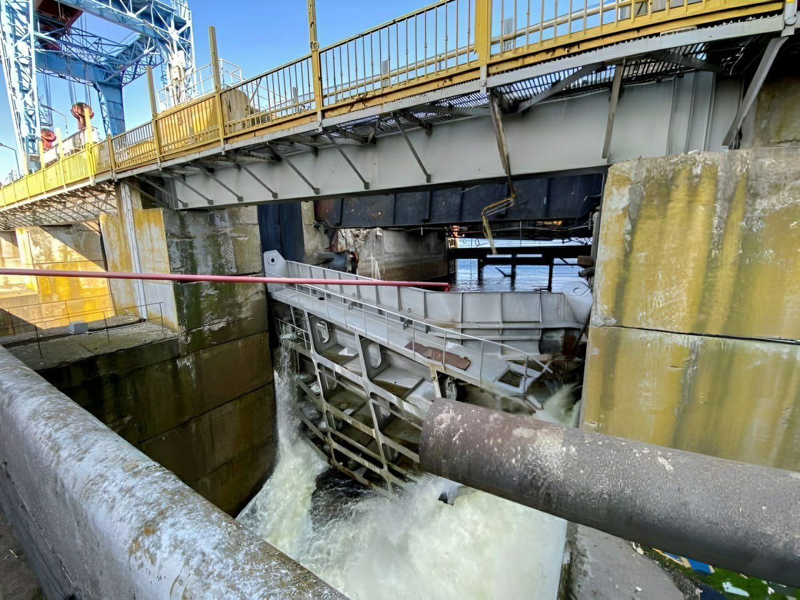

Illustrative March 2023 photo, more close-up photos: [5 March 2022](#h.gaipntgt02zh).

#### ~

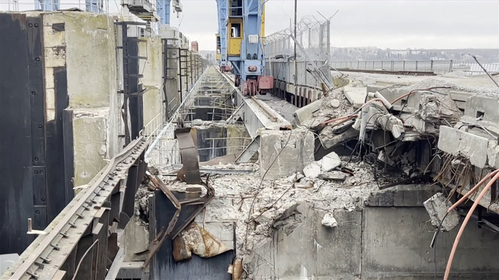

Rails and probably some cables over gate #1 are damaged

Source: [https://twitter.com/osintjourno/status/1672889664624107522/photo/3](https://twitter.com/osintjourno/status/1672889664624107522/photo/3) (repost)

#### ~

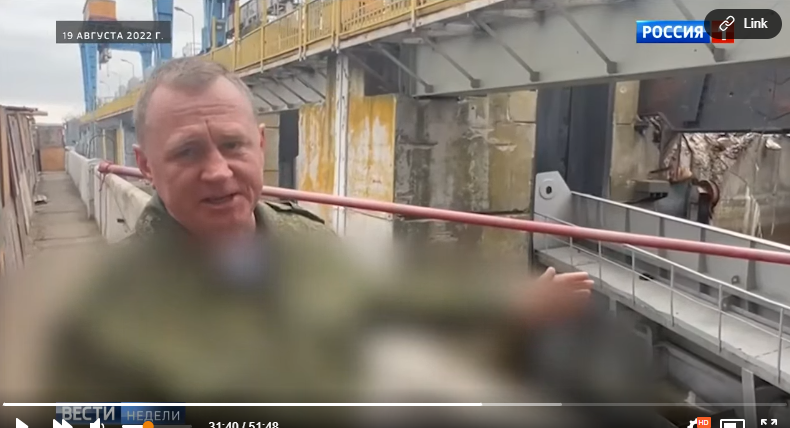

Source: [https://twitter.com/pustota/status/1668176418310705153](https://twitter.com/pustota/status/1668176418310705153)

Note: on the screenshot it is claimed to be 19 August 2022, but the video cannot be verified (unavailable) and this date contradicts the 02 September satellite photo above: in September the gates top is not damaged and there’s no narrow passage near the gates.

Judging by the position of the cranes and the #3 sluice gates hanging on the first crane hooks — these photos were taken after [11 Nov 2022](#h.pj4uqvu41jm4).

Notes

1.  There’s no evidence of an attempt to fix gates #1.
2.  Gate #3 is open, hanging on the crane hooks
3.  Gate #12 is open.  
    TODO: explain gate #12 strangeness. Tweet: [https://twitter.com/kddsky/status/1674189679749484547](https://twitter.com/kddsky/status/1674189679749484547)

#### ~

Ukraine Maj. Gen. Andriy Kovalchuk claimed in this Dec 2022 article:

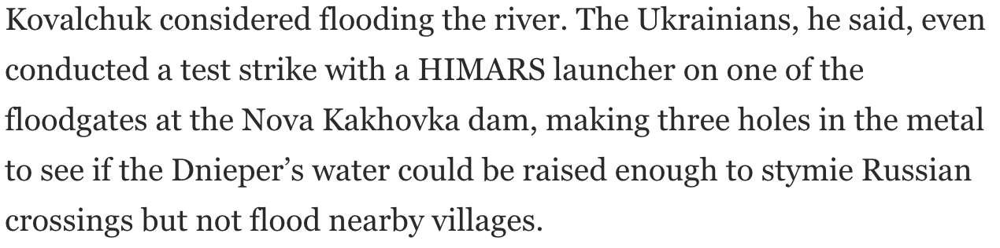

Source: [https://www.washingtonpost.com/world/2022/12/29/ukraine-offensive-kharkiv-kherson-donetsk/](https://www.washingtonpost.com/world/2022/12/29/ukraine-offensive-kharkiv-kherson-donetsk/)

Notes:

1.  There could be translation issues:

1.  Ukraine has also been hitting bridges over the Kakhovka Dam lock channel, Kovalchuk could be referring to it. And people tend to call the whole structure just “dam”.
2.  Not sure what 3 holes the article talks about. The only known broken gates are gates #1.

2.  Need more evidence.

### October 2022

#### 01 October 2022 — unverified: possibly leaking sluice gate #1

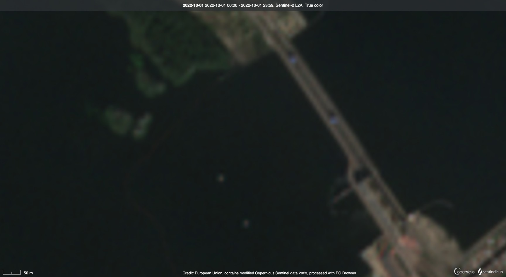

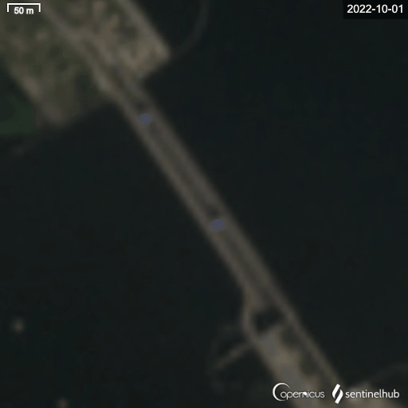

Source: [https://sentinelshare.page.link/23Zc](https://sentinelshare.page.link/23Zc) Sentinel

#### 18 October 2022

Source: [https://www.reuters.com/resizer/dmE48LYtjnEUBGxnXDhFmeDdh8o=/1920x0/filters:quality(80)/cloudfront-us-east-2.images.arcpublishing.com/reuters/DHX5ECYWJRM35LLZPQTE57G4LE.jpg](https://www.reuters.com/resizer/dmE48LYtjnEUBGxnXDhFmeDdh8o=/1920x0/filters:quality(80)/cloudfront-us-east-2.images.arcpublishing.com/reuters/DHX5ECYWJRM35LLZPQTE57G4LE.jpg) from [https://www.reuters.com/world/europe/is-kakhovka-dam-ukraine-about-be-blown-2022-10-21/](https://www.reuters.com/world/europe/is-kakhovka-dam-ukraine-about-be-blown-2022-10-21/) 

Notes:

1.  Gate #12 is open (strange one).
2.  By the algae lines, going straight to the HPP, I’d say that HPP gates are open.
3.  Gates open: #5 #7 #9 — #12 — #14, #16, #18
4.  Gates are opened in an opened-closed-opened pattern, two symmetrical sets, like they used to be opened before the occupation. I think there’s still someone who knows what they are doing.

### 02 November 2022 — unverified: possibly leaking sluice gate #1

Turbulent water stream is visible near the #1 gates

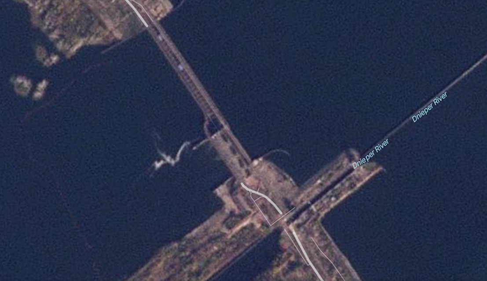

Source: [https://twitter.com/gbrumfiel/status/1634976125142327297](https://twitter.com/gbrumfiel/status/1634976125142327297) by [@planet](https://twitter.com/planet)

Note:

1.  It is unclear, but probably gate #1 is leaking
2.  No gates are open (#12 is unclear)
3.  Cranes are over #25 and #17 gates

### 10 November 2022 — opened gates #23

### 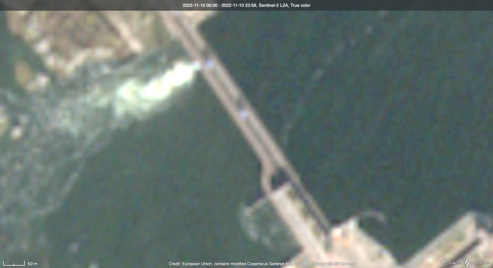

Source: [https://sentinelshare.page.link/7fXG](https://sentinelshare.page.link/7fXG)

### 11 November 2022 — russians leave the right bank & blow up road sections

#### Nighttime (probably):

russians leave the right bank of Dnieper and blow up part of the road bridge, above 3 spillways, adjacent to the right bank (to the ground dam on the right bank side). Sluice gates #26, #27 and #28 are damaged and are leaking afterwards.

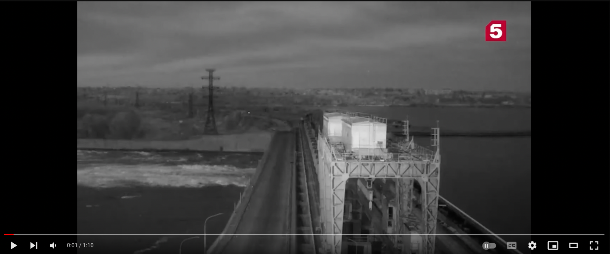

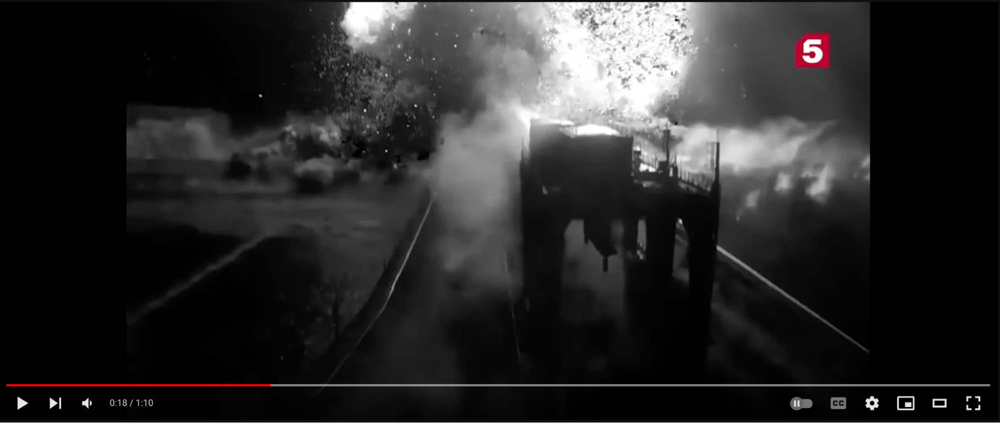

Source: [https://t.me/gruntmedia/22064](https://t.me/gruntmedia/22064)

Source: [https://www.youtube.com/watch?v=YA2norBud1s](https://www.youtube.com/watch?v=YA2norBud1s)

Notes:

1.  There’s a significant explosion wave, shaking even the HPP building where the camera stands.
2.  See [https://twitter.com/Maxar/status/1591158455808954368](https://twitter.com/Maxar/status/1591158455808954368), [https://twitter.com/grntmedia/status/1591848165636206592](https://twitter.com/grntmedia/status/1591848165636206592), [https://sentinelshare.page.link/kecu](https://sentinelshare.page.link/kecu) for leakage on #26, #27, #28 gates.
3.  There’s a significant outflow from gates closer to the right bank. Those are probably gates #23 that were opened the day before. Those gates would be closed in the morning (see next photo)

#### Daytime, 10:25 in the morning

Source (high res): [https://news.liga.net/ua/politics/news/okkupanty-vzorvali-neskolko-proletov-mosta-k-plotine-kahovskoy-ges-sputnikovye-snimki](https://news.liga.net/ua/politics/news/okkupanty-vzorvali-neskolko-proletov-mosta-k-plotine-kahovskoy-ges-sputnikovye-snimki) 

Source: [https://twitter.com/Maxar/status/1591158455808954368](https://twitter.com/Maxar/status/1591158455808954368)

Notes:

1.  The sluice gates #23 that were opened before the explosion are now closed. Is it possible that the explosion itself shut them?
2.  The separator wall between HPP and spillway dam is intact (highlighted)  
    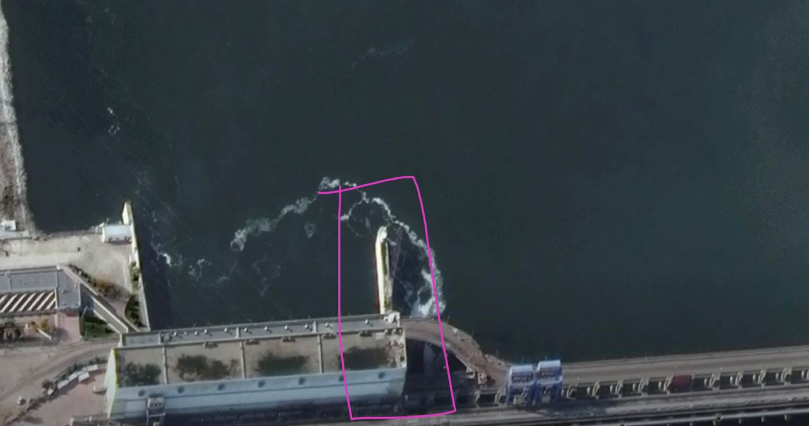
3.  It's not clear whether an explosion on the other side could increase the leakage from gates #1.
4.  Gates #12 are raised, but there’s no visible outflow.
5.  HPP intake sluice gates are partially open (not clear if there’s significant flow through the turbines)
6.  HPP crane is intact, but will be seen damaged on [11 March 2023 (the wall stands)](#h.ogir8kreukje)
7.  Is it #1 or #2 gates leaking? See white water behind the 1-2 gates separating pillars.  
    

#### Damaged part from aside

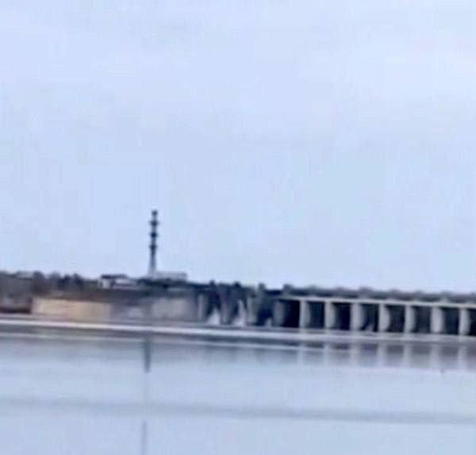

Source: [https://t.me/news\_5ua/28396](https://t.me/news_5ua/28396) 

#### Close-up photo of the damaged part, from 29 June 2022 (after the breach)

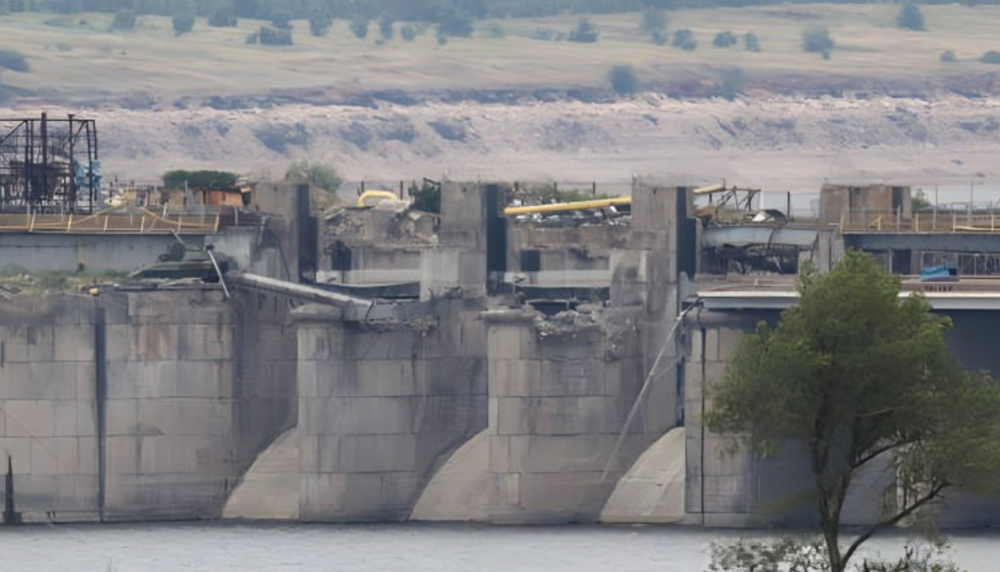

Source: [https://t.me/printerfort/5182](https://t.me/printerfort/5182) from [29 June 2023](#h.d9bl0tqb1mfr)

### 13 November 2022

 

Source: [https://twitter.com/grntmedia/status/1591848165636206592](https://twitter.com/grntmedia/status/1591848165636206592) 

Source: [https://t.me/gruntmedia/22197](https://t.me/gruntmedia/22197) 

Notes:

1.  Note the waves, hitting the separator wall from the side.
2.  Gate #5 is open
3.  Gate #12 is open, but there’s no visible outflow.

### 15 November 2022

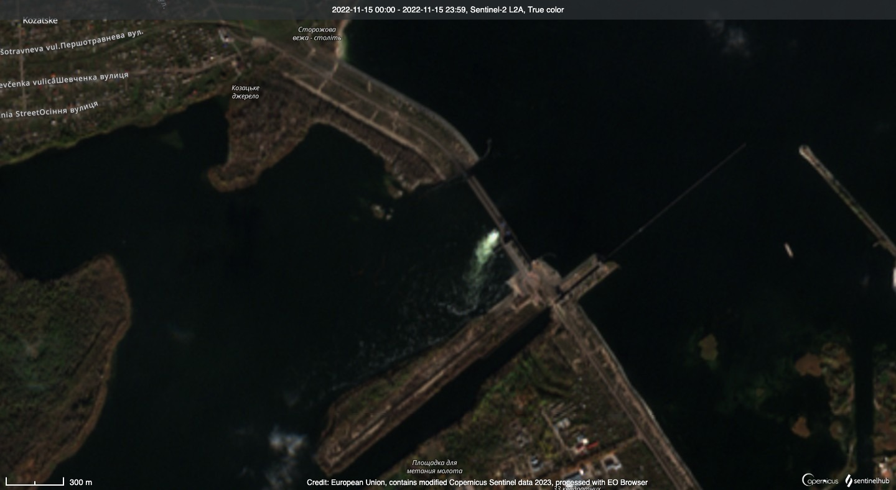

Source: [https://sentinelshare.page.link/ccg8](https://sentinelshare.page.link/ccg8)

Notes:

1.  Seems like still only one of the gates is opened (probably #5, as it was on 13 Nov)
2.  Between 15 Nov 2022 and 01 Jan 2023 more gates would be opened.

### 01 January 2023

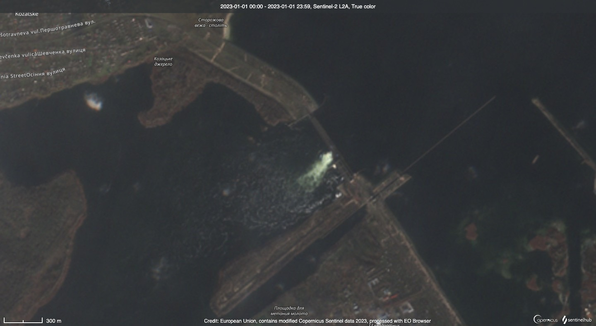

Source: [https://sentinelshare.page.link/mXNi](https://sentinelshare.page.link/mXNi)

Notes:

1.  Note the length and area of the white turbulent water. It spans far behind the riverbed protective layer. But it’s unclear how deep that turbulent water layer can be.
2.  For gates state see 02 January 2023 notes.

### 02 January 2023

Source: [https://www.npr.org/2023/02/10/1155761686/russia-is-draining-a-massive-ukrainian-reservoir-endangering-a-nuclear-plant](https://www.npr.org/2023/02/10/1155761686/russia-is-draining-a-massive-ukrainian-reservoir-endangering-a-nuclear-plant)

Notes:

1.  State of the gates won’t change ever after
2.  Gate #5, #6, #7 are open
3.  It is unclear, #3 might be already raised, hanging on the hooks (judging by the strong turbulent water in the gate #3 channel)
4.  Gate #12 is raised, no visible outflow
5.  Gates #26, #27, #28 are leaking

### 19 February 2023

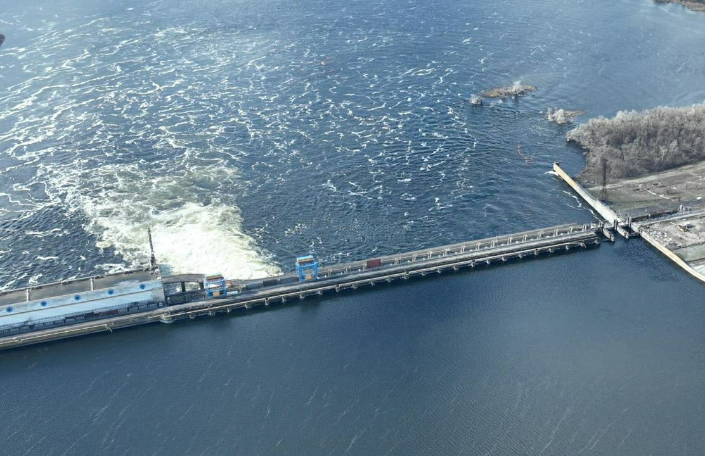Source: [https://pbs.twimg.com/media/FpWYSYwWcAEidHH?format=png&name=medium](https://pbs.twimg.com/media/FpWYSYwWcAEidHH?format=png&name=medium) via [https://twitter.com/huruank/status/1627374284514418690](https://twitter.com/huruank/status/1627374284514418690)

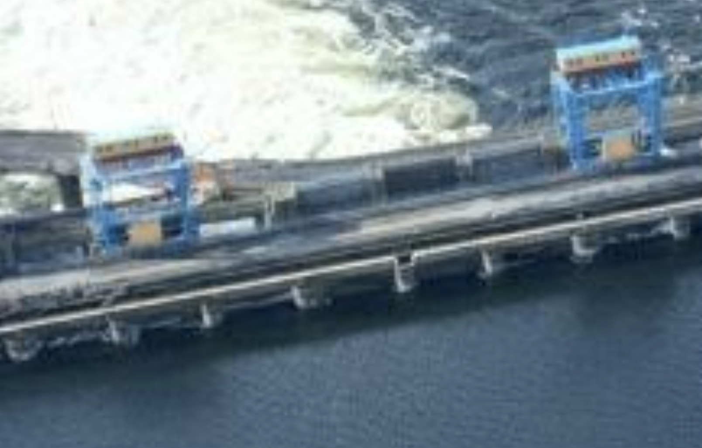

Note:

1.  Gate #3 is raised, hanging on crane hooks
2.  Gate #5, #6, #7 are open
3.  Gate #12 is open, but there’s no visible outflow.

### 01 March 2023 — low water levels in Kakhovka Reservoir due to constant drainage

Lower water level in the Kakhovka Reservoir, Enerhodar city, near ZNPP:

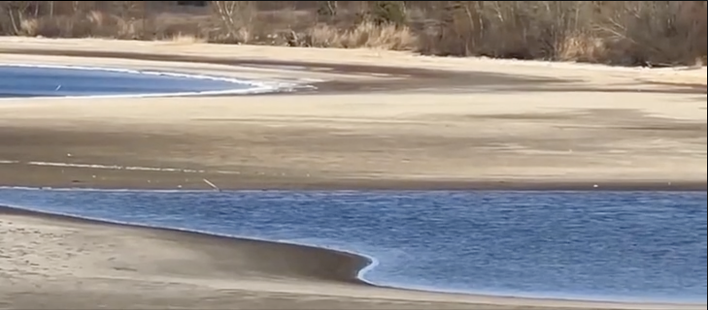

\> Энергодар ...

\> после подрыва дамбы Каховской ГЭС уровень воды в районе ЗАЭС ....

Source: [https://t.me/supernova\_plus/17958](https://t.me/supernova_plus/17958)

### 5 March 2023 — date unconfirmed — close-ups of dam/hpp damage

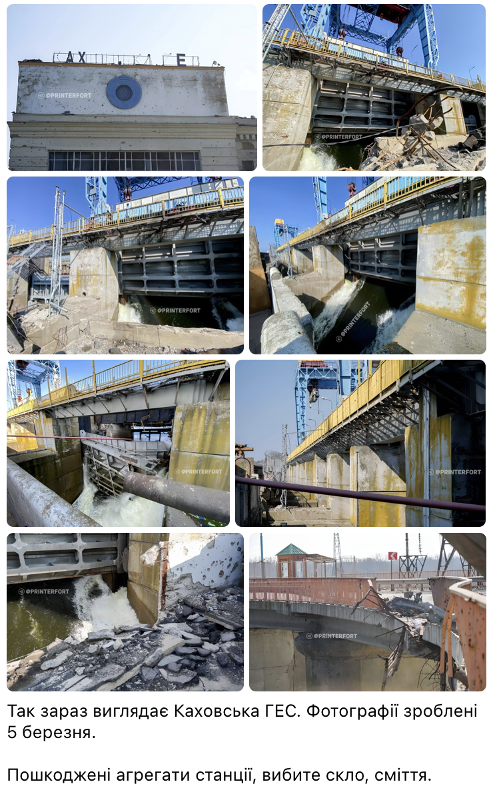

Source: [https://t.me/printerfort/3790](https://t.me/printerfort/3790)

Later: [https://twitter.com/NOELreports/status/1632820747470077953](https://twitter.com/NOELreports/status/1632820747470077953) 

#### ~

ru propaganda video, from the same spot, form about the same time:

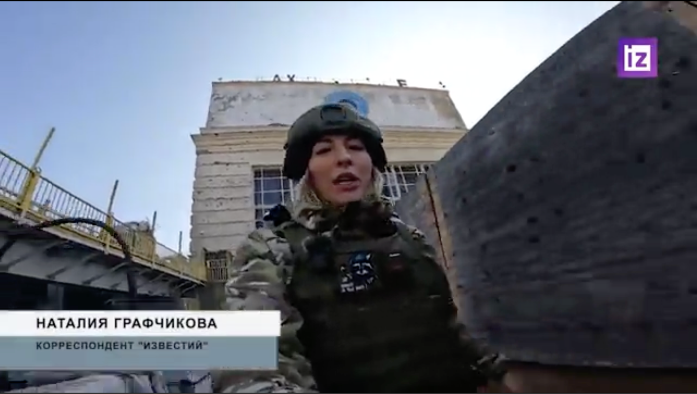

Source: [https://t.me/rentv\_news/86832](https://t.me/rentv_news/86832) (ru propaganda)

Warning: There are doubts about the date of the images above. Doubts are related to seeming high water level on Gate #1 photo, which was low in December-April period.  
Doubts 1: [https://twitter.com/davidhelms570/status/1633278604405555201](https://twitter.com/davidhelms570/status/1633278604405555201)Doubts 2: [https://twitter.com/Flash\_news\_ua/status/1632868901053779972](https://twitter.com/Flash_news_ua/status/1632868901053779972) 

At most they were made on 5 March. At least [13 Nov 2022](#h.3t4z7t8d08so) (because of the #3 gate raised)

### 11 March 2023 — water drainage, HPP crane destroyed

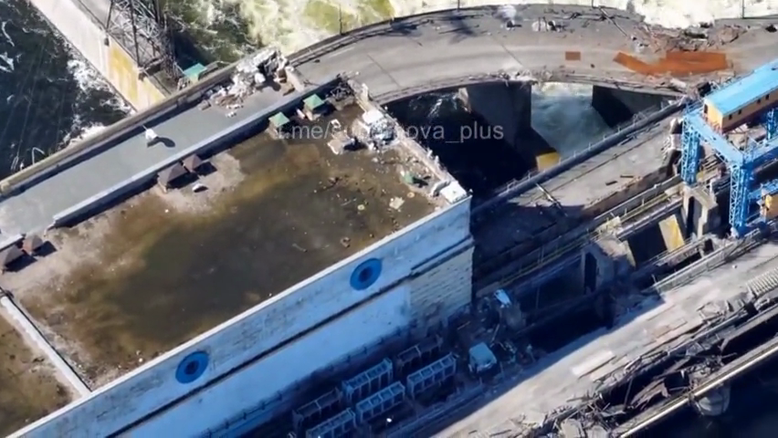

\> Каховская ГЭС .... федерация гавна спускает воду с Каховского моря…

Source: [https://t.me/supernova\_plus/18264](https://t.me/supernova_plus/18264)

Notes:  
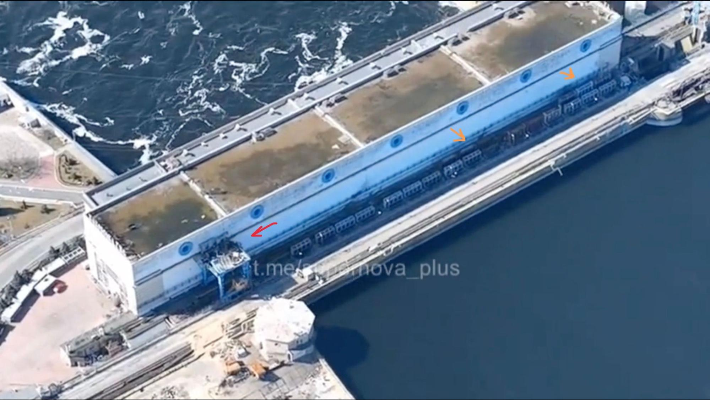

1.  Debris screens and sluice gates on HPP are opened (orange arrows)
2.  Crane that operates HPP sluice gates is destroyed (red arrow)

### 24 March 2023 — UkrHydroEnergo: russian gate management doesn’t make sense

\> «МАНІПУЛЯЦІЇ РОСІЯН ІЗ ЗАТВОРАМИ КАХОВСЬКОЇ ГЕС НЕ МАЮТЬ ЛОГІЧНОГО ПОЯСНЕННЯ» — Ігор Сирота

\> Ігор Сирота каже, що наприкінці лютого – початку березня росіяни спустили Каховське водосховище майже до критичної відмітки. Але аномальний зимовий паводок, який трапляється раз на десятки років сприяв його наповненню.

Source: [https://uhe.gov.ua/media\_tsentr/novyny/manipulyacii-rosiyan-iz-zatvorami-kakhovskoi-ges-ne-mayut-logichnogo](https://uhe.gov.ua/media_tsentr/novyny/manipulyacii-rosiyan-iz-zatvorami-kakhovskoi-ges-ne-mayut-logichnogo) 

### 16 April - 4 May 2023 — first signs of overtopping

Source: [https://sentinelshare.page.link/3ib2](https://sentinelshare.page.link/3ib2) 

### Sidenote: analysis of the reservoir water management and gates operation

#### Dam gates state & management

[David Helms](https://twitter.com/davidhelms570) was tracking gates & cranes state, here are his findings + my minor additions

Source: publicly available [https://twitter.com/davidhelms570/status/1668349492691623955](https://twitter.com/davidhelms570/status/1668349492691623955)

Note: David generously shared the document with me, the screenshot above was taken from it.

#### HPP gates state & management

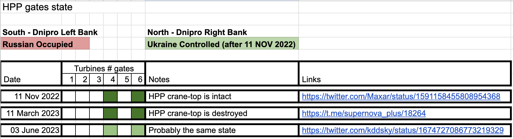

The algae trace on [03 June 2023](#h.ocek4il4hg9l) photos, just before the breach

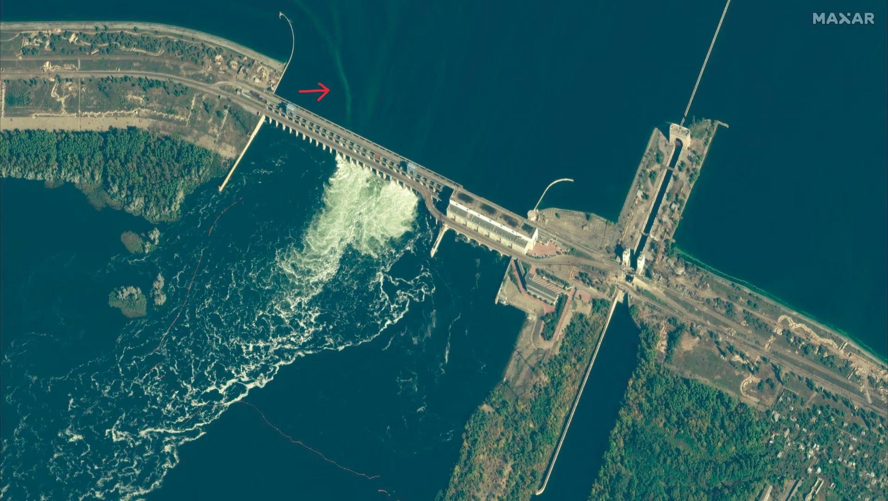

is similar to the [18 October 2022](#h.n5ddwwc4har) algae trace. This might indicate that HPP intake is open in June, and water is flowing through.

According to the [Blueprints](#h.gocvqmiqkt2w), it seems like these are HPP intake gates (closer to the wall), and debris screens (further from the wall).

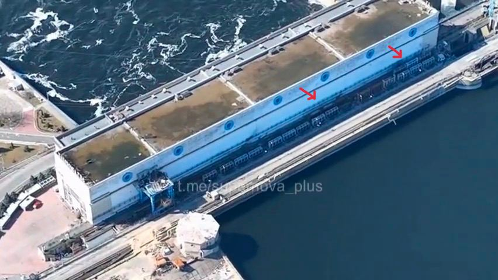

Source: [11 March 2023](#h.ogir8kreukje) video screenshot.

Tracing back the HPP gates’ state — it seems like they’ve been partially opened since at least [11 November 2022](#h.41enp935qi1v), and it was never changed ever after. And on September 6, 2022 — 4 out of 6 turbines were working: [06 September 2022](#h.gfso0ag6pegh). Also note that on [11 March 2023](#h.ogir8kreukje) the HPP crane-top is destroyed.

Note:

*   It is unclear how strong is the flow of water through the turbines, but on this video we hear some strong background noise inside the HPP: [25 March 2022 — inside HPP](#h.a5i15ltsvfeb), which might indicate flowing water.
*   It is unclear if HPP river-bottom gates are opened or not (that surpasses turbines)

My speculations:

*   it is possible that without fixing the crane — the HPP intake could not be adjusted.
*   constant water flow through HPP gates near the separator wall could catalyze the riverbed scouring.

#### Feb - Jun — Extreme drainage and overtopping

As seen on the gate operation charts above — at least since January 2033 the HPP and the sluice gates were not operated.

This lead first to over-drainage and then to overtopping of Kakhovka Reservoir during December 2022 - June 2023 period.

#### Kakhovka reservoir water levels (2016-2023)

Source: [https://hydroweb.theia-land.fr/hydroweb/view/L\_kakhovka?lang=en&basin=Dniepr&lake=kakhovka](https://hydroweb.theia-land.fr/hydroweb/view/L_kakhovka?lang=en&basin=Dniepr&lake=kakhovka)

Alternative source: [https://ipad.fas.usda.gov/cropexplorer/global\_reservoir/gr\_regional\_chart.aspx?regionid=umb&reservoir\_name=Kakhovskoye&lakeid=100873](https://ipad.fas.usda.gov/cropexplorer/global_reservoir/gr_regional_chart.aspx?regionid=umb&reservoir_name=Kakhovskoye&lakeid=100873)

~

[David Helms](https://twitter.com/davidhelms570) [@davidhelms570](https://twitter.com/davidhelms570)

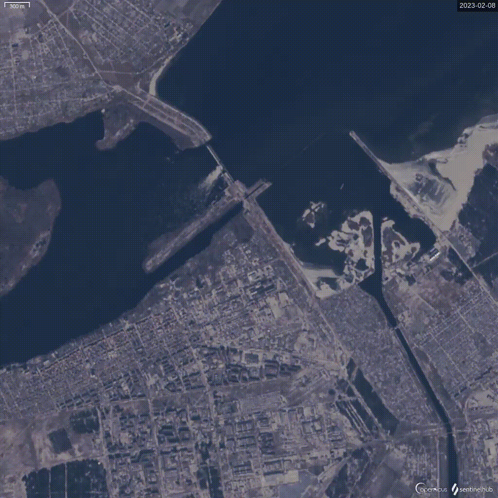

\> 1. Ruschist operation of Kakhovka HPP (K-HPP) dam has been reckless. Kakhovka Reservoir (KR) water level has alternated from record low to record high in just 3 months. Loop (6 FEB-6 MAY 2023) shows sand bars receding with rising KR water. [#NAFOWeather](https://twitter.com/hashtag/NAFOWeather?src=hashtag_click)

Source: [https://twitter.com/davidhelms570/status/1655226067425062912](https://twitter.com/davidhelms570/status/1655226067425062912) 

[David Helms](https://twitter.com/davidhelms570) [@davidhelms570](https://twitter.com/davidhelms570)

\> [#KakhovkaReservoir](https://twitter.com/hashtag/KakhovkaReservoir?src=hashtag_click) [#KakhovkaHPP](https://twitter.com/hashtag/KakhovkaHPP?src=hashtag_click) 1/ Status Follow-up: 30 May 2023. Over-topping of [#KakhovkaHPP](https://twitter.com/hashtag/KakhovkaHPP?src=hashtag_click) dam continues, now occurring for a full month.

Source: [https://twitter.com/davidhelms570/status/1663569718496620544](https://twitter.com/davidhelms570/status/1663569718496620544) 

TODO: cover why this mode of operation of the Dam was bad:

*   Gates should be opened symmetrically (TODO: proof)
*   Gates should not be opened for long period of times (TODO: proof)
*   Water levels were below and above normal operation limits (TODO: proof)
*   cover rumors of Belarus’ dam breach
*   cover UA Dnipro reservoirs water levels.

### 28 April 2023 — part of the wall separating HPP & dam breaks

Part of the wall, that separates HPP from the barrage spillways broke and is partially submerged:

Source: [https://youtu.be/6XNV9QfHm54?t=20](https://youtu.be/6XNV9QfHm54?t=20) 

It is a few meters thick reinforced concrete structure:

Reference of the wall on google street view.

Source: [https://www.google.com/maps/@46.7769888,33.3703578,3a,75y,207.49h,84.97t/data=!3m6!1e1!3m4!1skdHxUrARCiH\_ul1lFIdRzQ!2e0!7i13312!8i6656?entry=ttu](https://www.google.com/maps/@46.7769888,33.3703578,3a,75y,207.49h,84.97t/data=!3m6!1e1!3m4!1skdHxUrARCiH_ul1lFIdRzQ!2e0!7i13312!8i6656?entry=ttu)

Notes:

1.  By 28 April 2023 water has been constantly drained through gates upstream for at least 166 days (since [13 November 2022](#h.3t4z7t8d08so))
2.  This break likely indicates that the foundation of the wall is damaged. And further scouring of the riverbed is expected.
3.  Gate #3 is raised on the crane hooks & there’s visible water intake
4.  Gate #5, #6, #7 are opened
5.  Gate #12 is raised, no visible water flowing through.  
    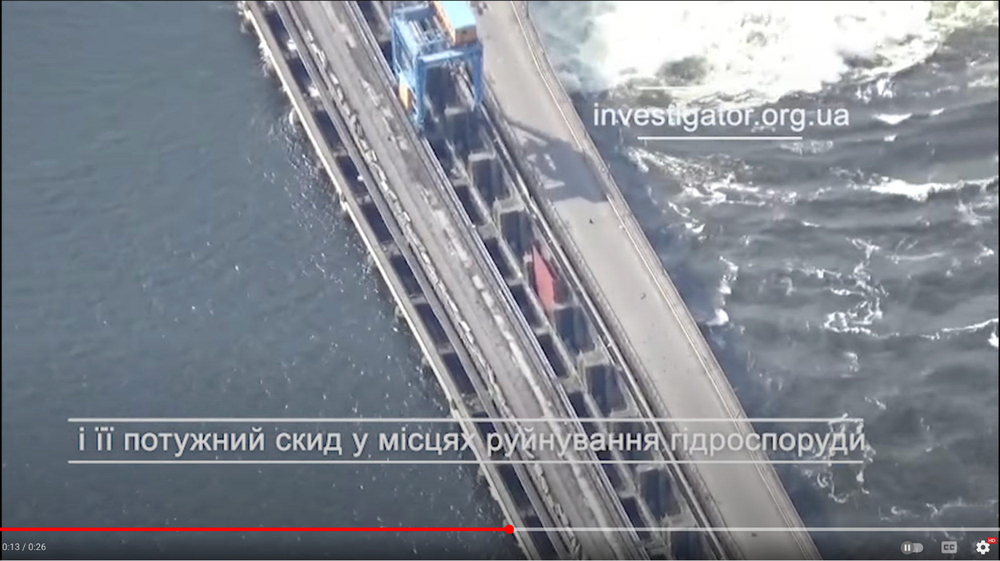
6.  This is the first time we see the white car with the explosives. AP will write [an article](#h.gr1x50x519sp) about it.

#### My speculations on how it happened and what this means

From the tip of the wall till the sluice gates there’s about 100 - 120 meters:

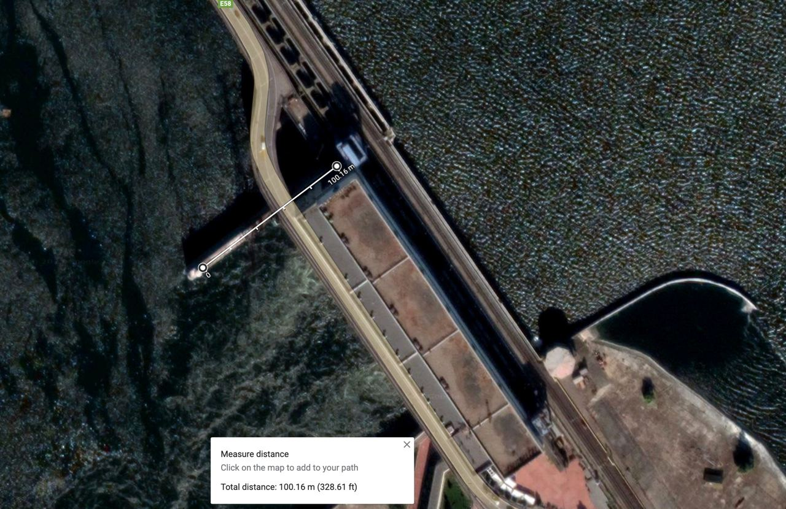

Thus we can deduce foundation under that piece that broke off:

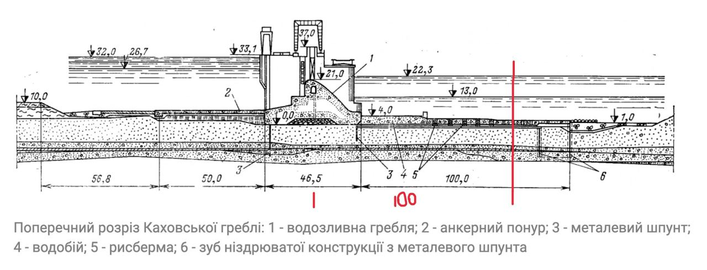

Looks like that tip that broke off was standing on or near the [rysberma](https://uk.wikipedia.org/wiki/%D0%A0%D0%B8%D1%81%D0%B1%D0%B5%D1%80%D0%BC%D0%B0) or riprap (#5 above). Riprap is a layer of rocks and concrete, that lies right after the 4m thick concrete apron (#4). Riprap protects riverbottom from scouring, breaks and slows down the stream to normalize it with the rest of the water. It is claimed that during Kakhovka dam construction water levels could not be managed properly during floods. Because of that water drainage happened in extreme conditions, which lead to riverbed scouring just downstream from rysberma. [K-Dam river bed was already scoured once](#h.ptasfgmuswer)

After that wall tip broke off we can say that the riprap was damaged and the riverbed was prone to further scouring.

Further water drainage through gates #1, #3, #5-7 and probably HPP gates would further erode the foundation of the wall, leading to the foundations of the s-bridge that would fall on [June 1-2-3](#h.ocek4il4hg9l).

##### Sidenote on stream direction

On [13 Nov 2022](#h.3t4z7t8d08so) we saw some side-waves hitting the separator wall:

And from various pictures from autumn till summer, it seems like generally the turbulent water stream was bending towards the left bank, i.e. towards that wall.

##### More speculations on the wall foundation

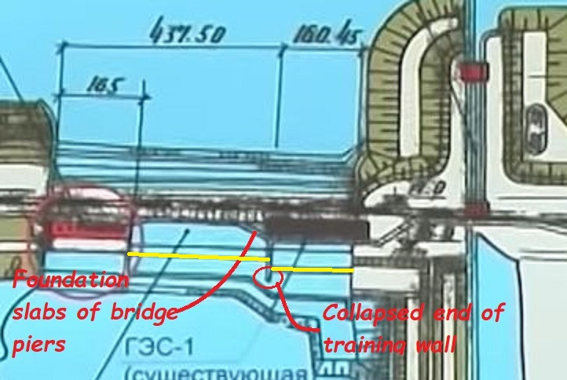

Kakhovka 2nd HPP presentation screenshot

Source: [https://twitter.com/PavewayIV/status/1670627701525295105](https://twitter.com/PavewayIV/status/1670627701525295105) 

It might be that the tip of the wall that fell off, stood on some edge of support layers. But we can’t rely on the presentation screenshots. Until we have top-down blueprints of the dam, we can’t say much more about the foundation.

#### K-Dam river bed was already scoured / washed out once in 1950s

In 1950-s a flood occurred during the construction of the dam. This forced engineers to drain water through gates on one side of the dam, while water level downstream of the dam was 2 meters below normal — that led to river bed scouring / washout downstream from [rysberma](https://uk.wikipedia.org/wiki/%D0%A0%D0%B8%D1%81%D0%B1%D0%B5%D1%80%D0%BC%D0%B0) (riprap) for 9m deep.

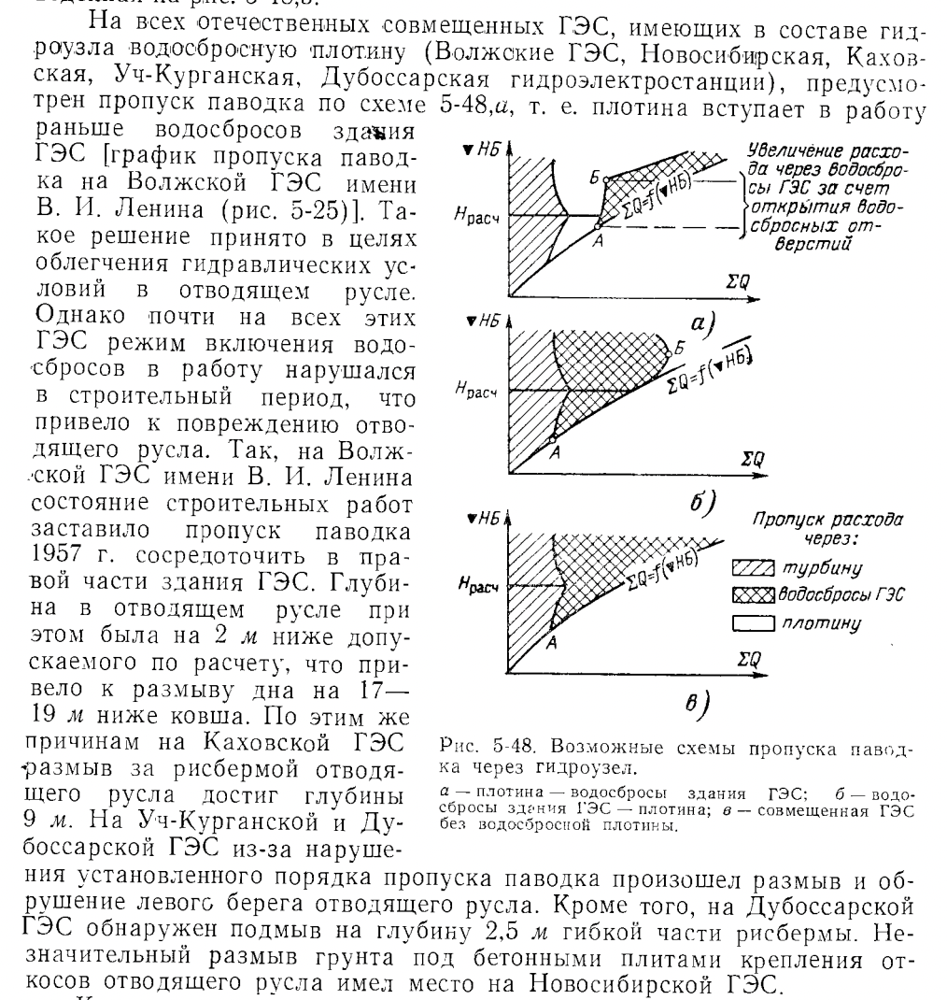

Source: “Гидравлика зданий гидроэлектростанций” С. М. Слисский, 1970 г., москва, page 251

Source: [https://kitab.ttnda.az/upload-files/books/09/1067/qidravlika\_zdaniy\_qidroelektrostanciy.pdf](https://kitab.ttnda.az/upload-files/books/09/1067/qidravlika_zdaniy_qidroelektrostanciy.pdf)

Source: [https://leg.co.ua/arhiv/generaciya/gidravlika-zdaniy-ges/Page-21.html](https://leg.co.ua/arhiv/generaciya/gidravlika-zdaniy-ges/Page-21.html) 

### 3 May 2023 — Overtopping

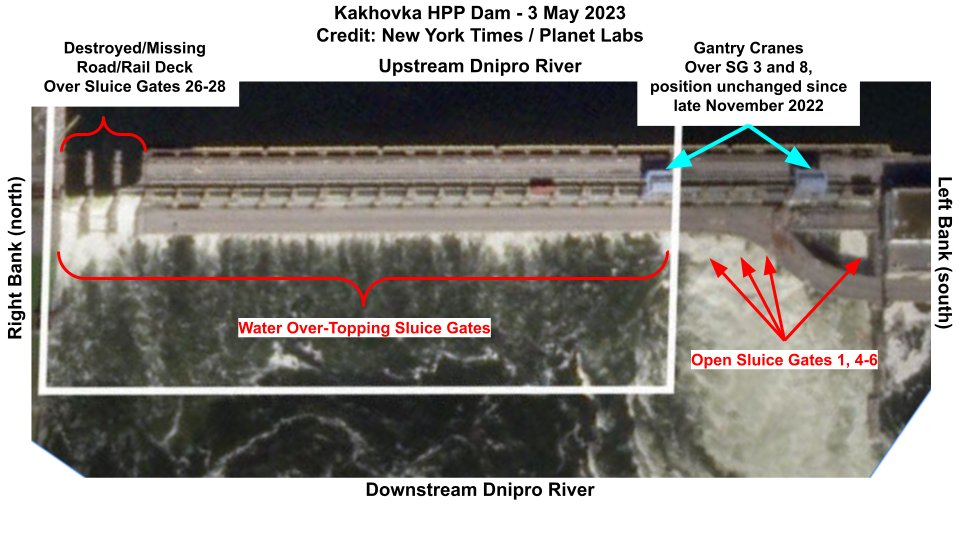

[David Helms (@davidhelms570)](https://twitter.com/davidhelms570) on twitter:

\> 5/ [@riley\_mellen](https://twitter.com/riley_mellen) and [@heytherehaley](https://twitter.com/heytherehaley) also published an article for [@nytimes](https://twitter.com/nytimes) on 17 May 2023 about [#KakhovkaHPP](https://twitter.com/hashtag/KakhovkaHPP?src=hashtag_click) water level. Article included a nice [#PlanetLabs](https://twitter.com/hashtag/PlanetLabs?src=hashtag_click) image from 3 May 2023 clearly showing dam over-topping.

[https://twitter.com/davidhelms570/status/1663569729770999808](https://twitter.com/davidhelms570/status/1663569729770999808)

Notes:

1.  Gates #12 are opened, but we see only signs of overtopping, not a turbulent flow like under opened gates 5-7.
2.  Gate #3 is probably opened too.

Photo source by Planet Labs from

[https://www.nytimes.com/2023/05/17/world/europe/dam-flood-ukraine-kakhovka.html?unlocked_article_code=UgqGFm_l-HDY9W0IeXEiUVJpYIRZmf7fPw_SXutxYnTNV64FXoAOJixCx7GYunM6cKKXEM0ZRiJY2vXswCmwkaidp76LMbpmr-S_tWJAkkf8MqHWeUGDH1BPZrqq27wy8SbhSZGY-vqXrf-x4sEDN1zzREJEtWQ45StbGXHiiI_MIt_E7xCLPd3cR-t3fm0e_3IKfBVdtXQfsXV8HEnNvsqu6B69DwNHty0INqcfJhid_mGmCz4qzYCbZ5yP88FjsPs3ft0iw8OOe4KCb8B76jGzI_sHM54Gx1uk6_GZ7-Qhgw2vPz8sn72GTYABIHKbO5ZrRhKJ_MtT8-foTZFXofC2soJvGZE45g&smid=tw-share](https://www.nytimes.com/2023/05/17/world/europe/dam-flood-ukraine-kakhovka.html?unlocked_article_code=UgqGFm_l-HDY9W0IeXEiUVJpYIRZmf7fPw_SXutxYnTNV64FXoAOJixCx7GYunM6cKKXEM0ZRiJY2vXswCmwkaidp76LMbpmr-S_tWJAkkf8MqHWeUGDH1BPZrqq27wy8SbhSZGY-vqXrf-x4sEDN1zzREJEtWQ45StbGXHiiI_MIt_E7xCLPd3cR-t3fm0e_3IKfBVdtXQfsXV8HEnNvsqu6B69DwNHty0INqcfJhid_mGmCz4qzYCbZ5yP88FjsPs3ft0iw8OOe4KCb8B76jGzI_sHM54Gx1uk6_GZ7-Qhgw2vPz8sn72GTYABIHKbO5ZrRhKJ_MtT8-foTZFXofC2soJvGZE45g&smid=tw-share)

### 16 May 2023 — overtopping

Video

Source: [https://youtu.be/wGacVIhtPR0?t=82](https://youtu.be/wGacVIhtPR0?t=82)

Notes:

1.  інший ракурс на зруйновану стіну, так само видно що одна секція напівзавалена. Не ясно чи руйнування збільшились чи ні.  
    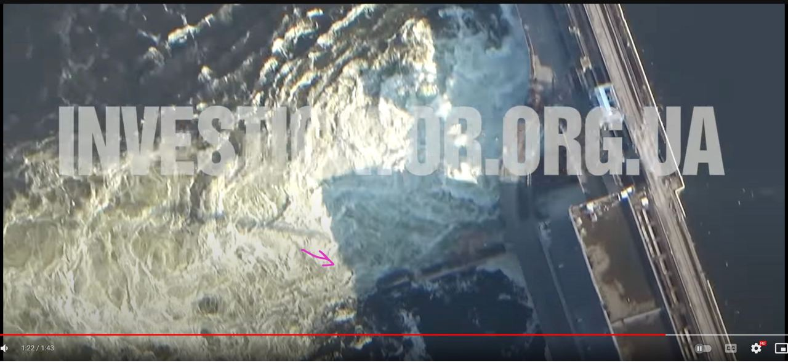
2.  Note gates #12 are opened, but we see only signs of overtopping, not a turbulent flow like under opened gates #5-7.
3.  Sand bags appear on the ru occupied side, behind the HPP:

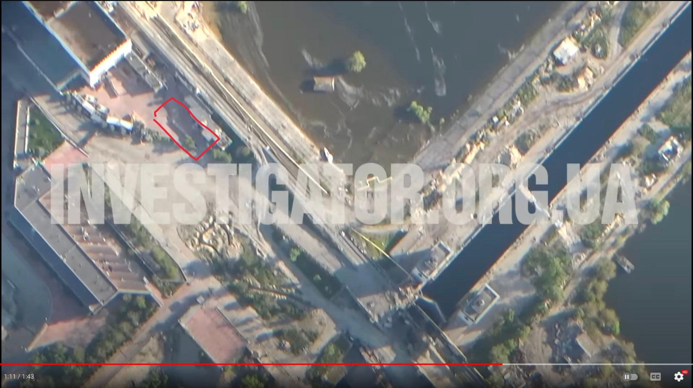

On [28 May 2023](#h.mamzkiespkql) we see other side of the HPP entrance path also has those bags: 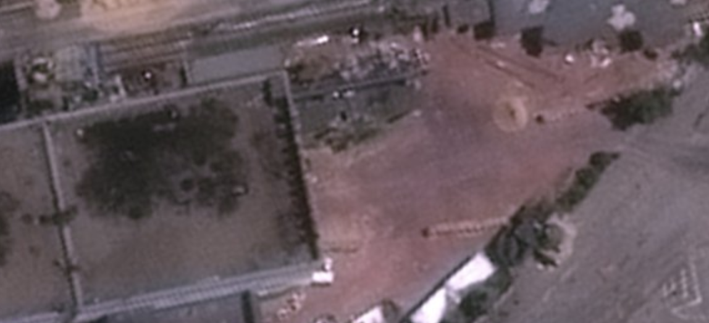

 We’ll see them close-up after the breach on [6 June 2023: Morning](#h.7j3py8ciswo0):

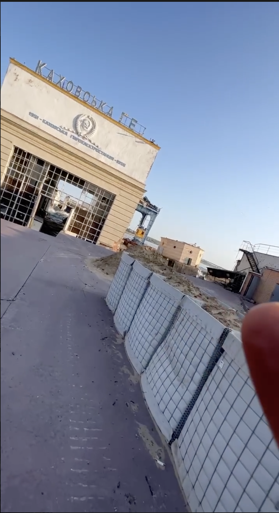

### 28 May 2023

Overtopping

Source: [https://twitter.com/ChristopherJM/status/1665948340855422977/photo/3](https://twitter.com/ChristopherJM/status/1665948340855422977/photo/3)

~

Source: @maxar via [https://twitter.com/gbrumfiel/status/1665974250472177665/photo/1](https://twitter.com/gbrumfiel/status/1665974250472177665/photo/1) 

### 31 May 2023 — russian legislation not to investigate accidents

“Russian government approves legislation to forgo probing accidents and terrorist acts at hazardous facilities before Kakhovka dam explosion”

Source: [https://theins.ru/en/news/262443](https://theins.ru/en/news/262443)

### 1-2 June & 2-3 June 2023 — overtopping & fall of the s-bridge

#### Overtopping and falling sections of s-bridge

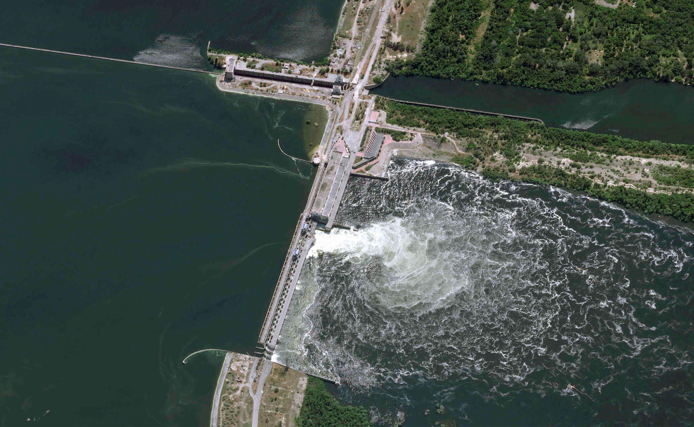

Source: A satellite image showing the dam three days before its destruction. Pléiades Neo Airbus DS 2023 [https://static01.nytimes.com/newsgraphics/2023-06-13-dam-explosion-ukraine/2e8d1037c76891a999bfedb910ba7041a100a11d/\_big\_assets/images/2023\_06\_03-airbus-1050\_x2.jpg](https://static01.nytimes.com/newsgraphics/2023-06-13-dam-explosion-ukraine/2e8d1037c76891a999bfedb910ba7041a100a11d/_big_assets/images/2023_06_03-airbus-1050_x2.jpg)From: [https://www.nytimes.com/interactive/2023/06/16/world/europe/ukraine-kakhovka-dam-collapse.html](https://www.nytimes.com/interactive/2023/06/16/world/europe/ukraine-kakhovka-dam-collapse.html) 

Notes:

1.  Overtopping is clearly seen on all gates
2.  Trail of algae behind the HPP closer to the left bank, probably indicates intake flow on the HPP
3.  Gate #12 is raised

#### ~

[Geoff Brumfiel (@gbrumfiel)](https://twitter.com/gbrumfiel)

\> This movie made using [@planet](https://twitter.com/planet) imagery shows the roadway failed over 2-3 of June.

Source: [https://twitter.com/i/status/1665974703935180801](https://twitter.com/i/status/1665974703935180801) 

#### ~

[Geoff Brumfiel (@gbrumfiel)](https://twitter.com/gbrumfiel)

\> JUST IN: High resolution images from [@Maxar](https://twitter.com/Maxar) showing damage at the Kakhovka HPP BEFORE it failed today. The image on the left is form 28 May. The image on the right is from June 5. The road is clearly gone, indicating the dam may have been starting to fail.

Source: [https://twitter.com/gbrumfiel/status/1665974250472177665](https://twitter.com/gbrumfiel/status/1665974250472177665)

#### Kos: Analysis of the s-bridge foundation

By the [@planet](https://twitter.com/planet) images above, it seems like the #3 support frame collapsed between 1-2 Jun, and #2 collapsed between 2-3 Jun.

Roughly, there's 23 meters of dam downstream the sluice gates, after which sits a concrete stilling basin apron. And judging by this scheme — the barrage and apron might be separate constructions. And it seems like #2 and #3 support frames broke off around that barrage-apron border.

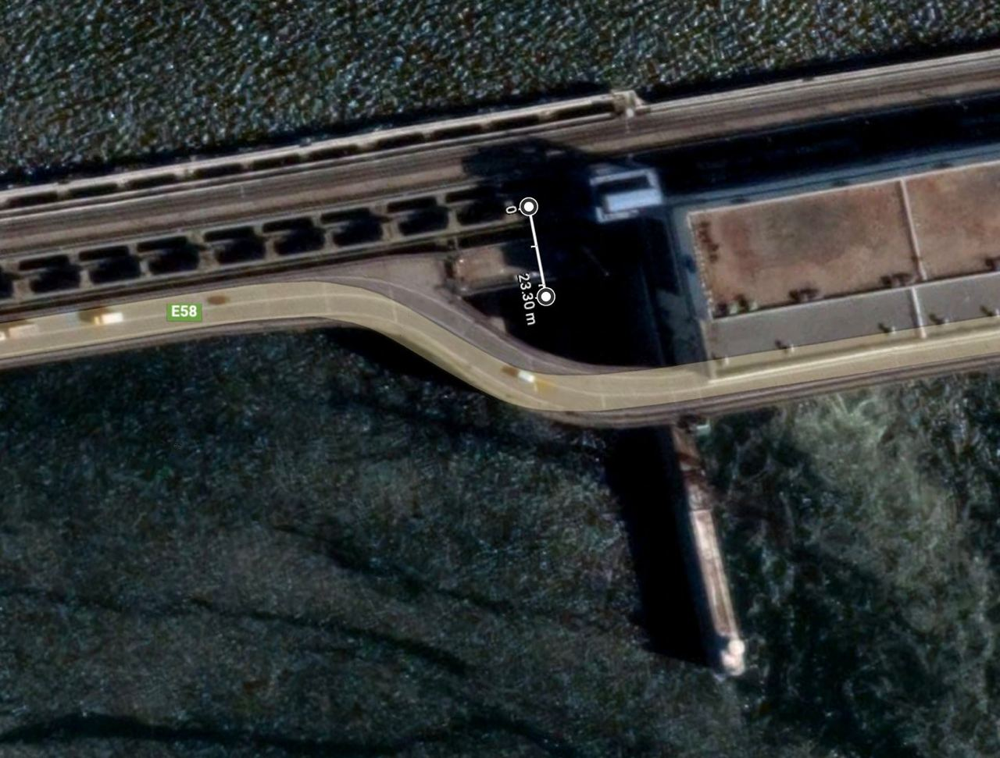

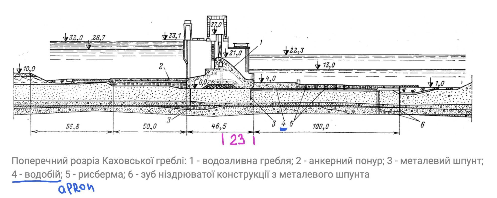

### 6 June 2023 — Breach

#### 2:18 — local chats report explosions

Source: [https://twitter.com/cxemu/status/1674112866088022016](https://twitter.com/cxemu/status/1674112866088022016) 

Note: couldn’t verify independently, somehow this chat history is corrupted for me.

#### ~ 02:46

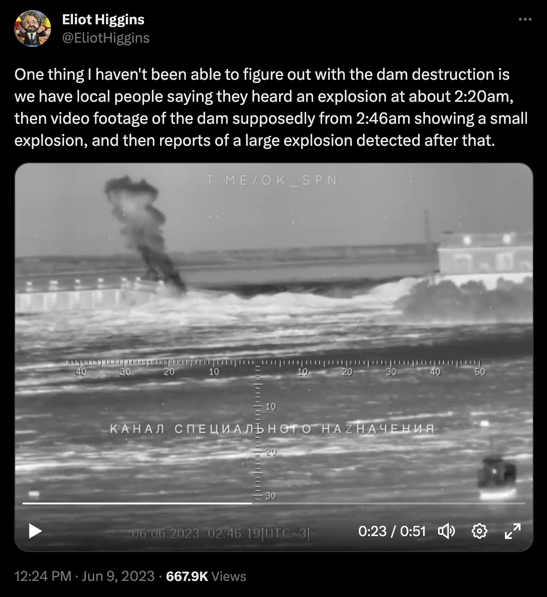

Source: [https://twitter.com/EliotHiggins/status/1667100337453277185](https://twitter.com/EliotHiggins/status/1667100337453277185) 

Source: [https://t.me/ok\_spn/25014](https://t.me/ok_spn/25014) (ru propaganda)

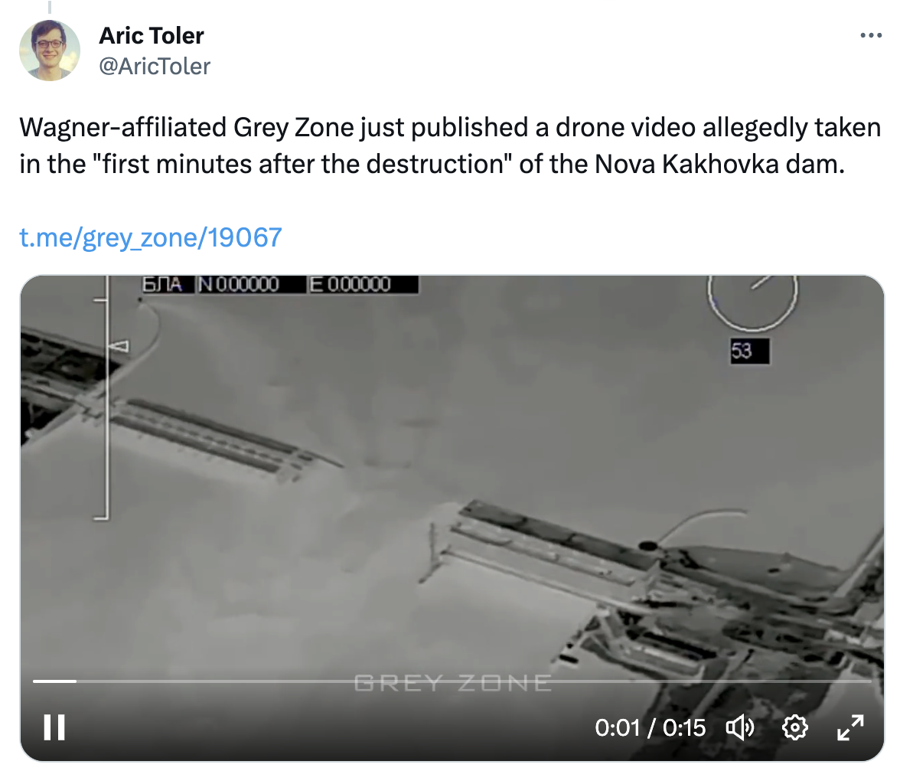

Source: [https://twitter.com/AricToler/status/1667558806463578112](https://twitter.com/AricToler/status/1667558806463578112)

Source: [https://t.me/grey\_zone/19067](https://t.me/grey_zone/19067)

Notes:

1.  Seems like the last spillway we see — are around gates #13, but they seem to be not as sinked, as seen on [16 June 2022 satellite images](https://twitter.com/cxemu/status/1669805342400602114).

#### The HPP starts to break

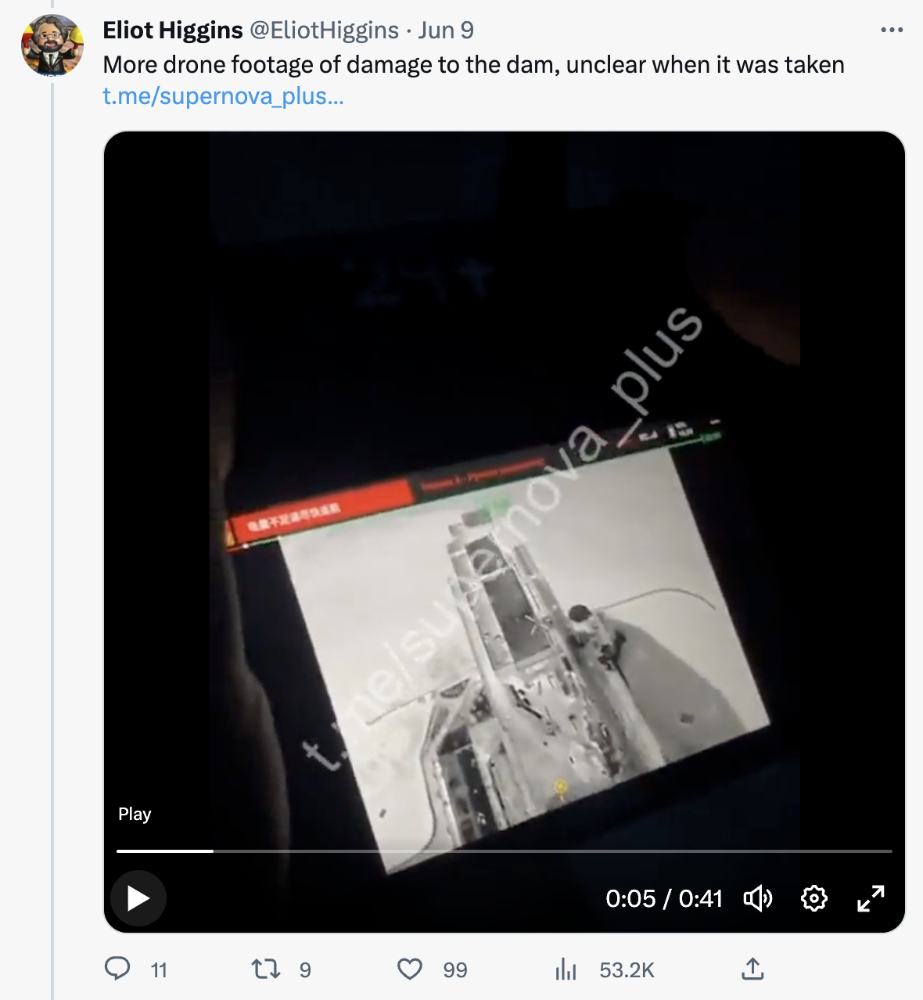

Source: [https://twitter.com/EliotHiggins/status/1667142092731154433](https://twitter.com/EliotHiggins/status/1667142092731154433)

Source: [https://t.me/supernova\_plus/21001](https://t.me/supernova_plus/21001) 

#### Morning

##### ~

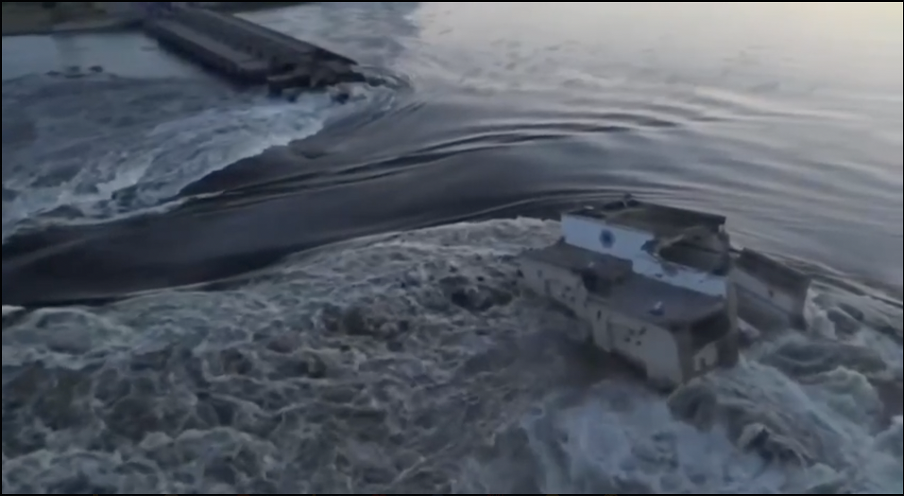

Source (short): [https://t.me/kherson\_non\_fake/7859](https://t.me/kherson_non_fake/7859)

Source (long): [https://t.me/novokah/5192](https://t.me/novokah/5192)

Source (long): [https://t.me/dva\_majors/16949](https://t.me/dva_majors/16949) (ru propaganda)

##### ~

Source: [https://t.me/Separ13\_13/14009](https://t.me/Separ13_13/14009)  (ru propaganda)

##### ~

“No incoming hits, that’s just water”, complains about lost equip

Source: [https://t.me/koloborantNK/3517](https://t.me/koloborantNK/3517)

Source: [https://t.me/kherson\_monitoring/9992](https://t.me/kherson_monitoring/9992)

##### ~

Mines exploding near the shoreline, leftbank, upstream from the dam

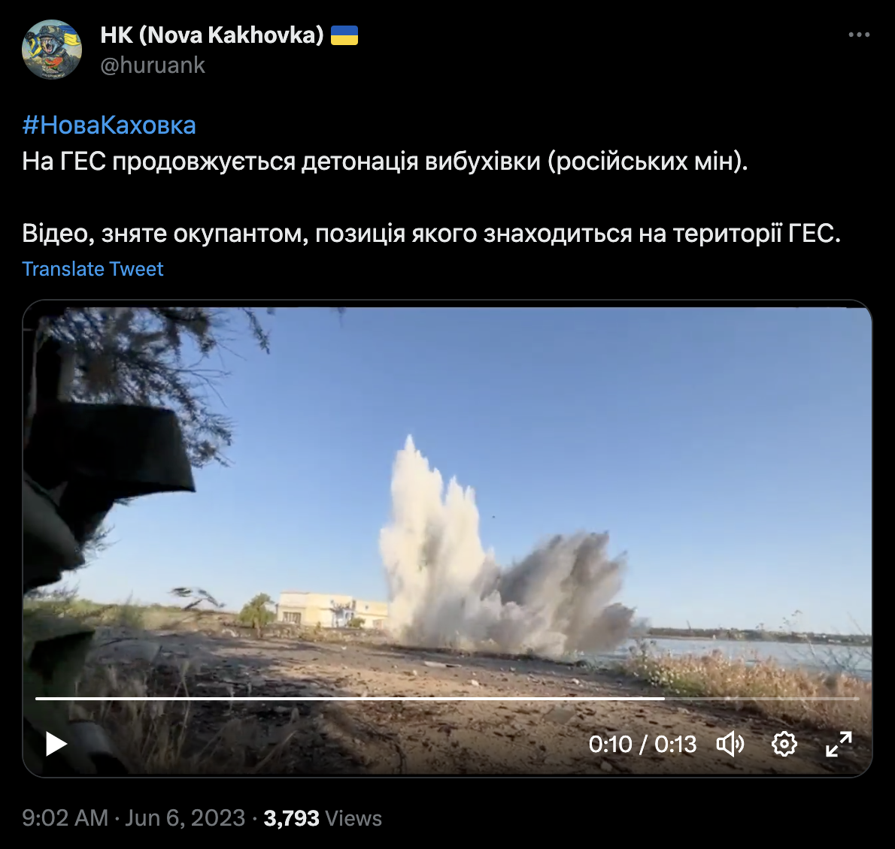

Source: [https://twitter.com/huruank/status/1665962301436882944](https://twitter.com/huruank/status/1665962301436882944) 

##### ~

Mines exploding near the shoreline, leftbank, upstream from the dam

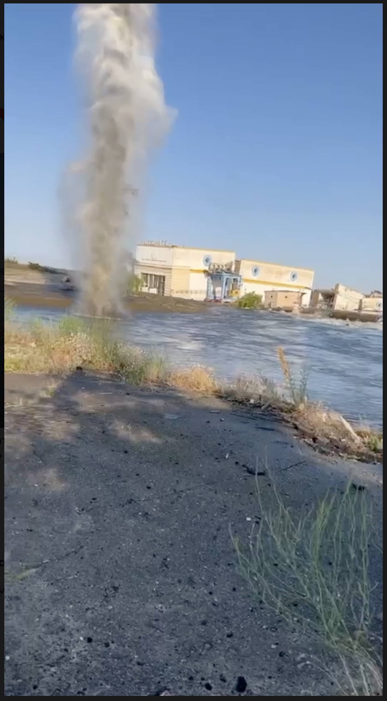

Source: [https://t.me/kherson\_monitoring/10046](https://t.me/kherson_monitoring/10046)

##### ~ 7:00 (unverified time)

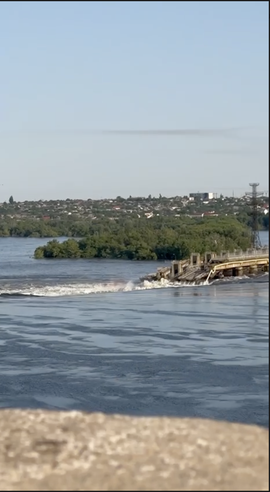

Source: [https://t.me/Separ13\_13/14012](https://t.me/Separ13_13/14012) (ru propaganda)

##### ~ 7:18 (unverified time)

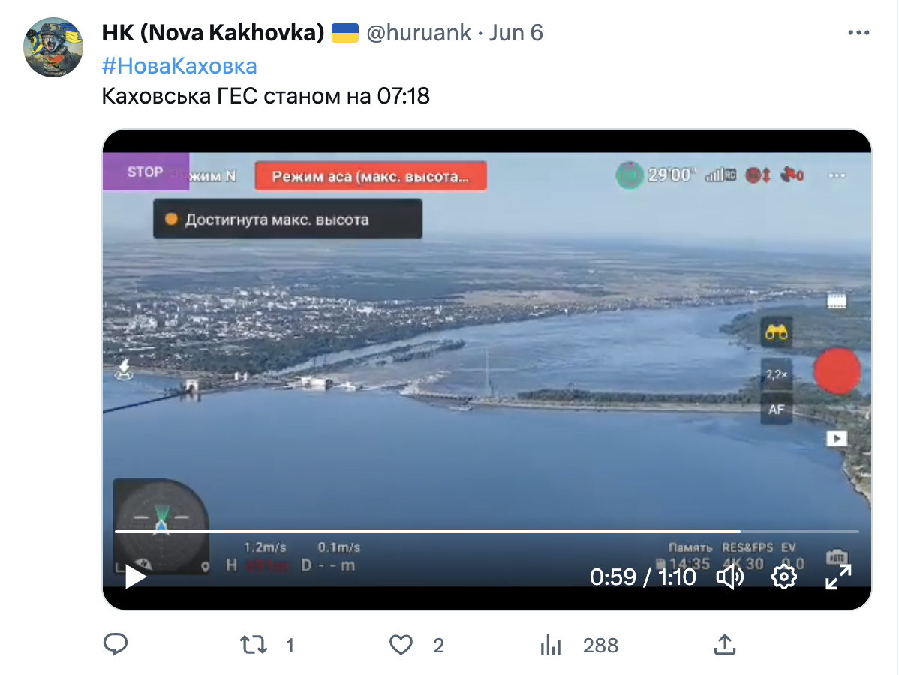

Source: [https://twitter.com/huruank/status/1666009860259868673](https://twitter.com/huruank/status/1666009860259868673) 

##### ~

Source: [https://t.me/Separ13\_13/14052](https://t.me/Separ13_13/14052)  (ru propaganda)

##### ~

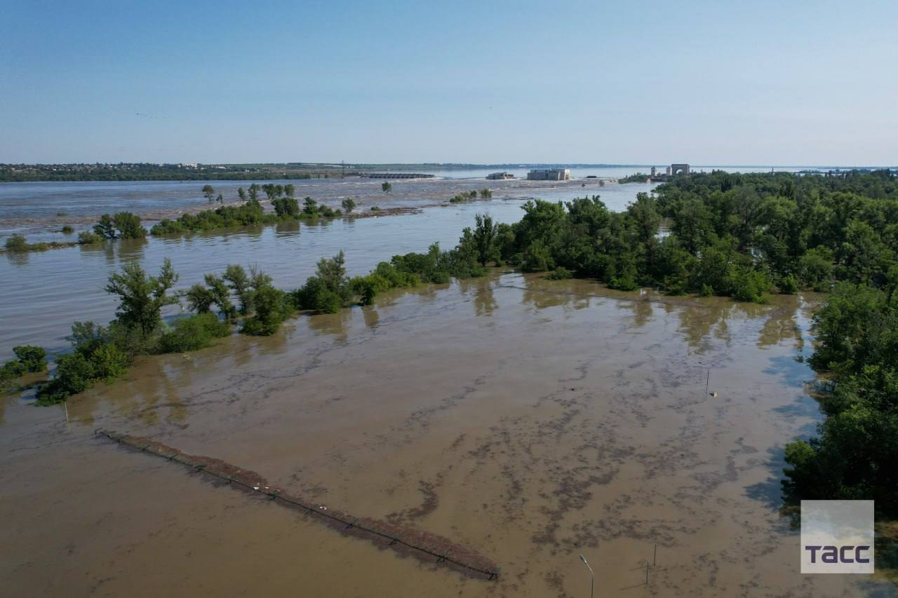

Source: [https://t.me/c/1183164487/60143](https://t.me/c/1183164487/60143) (ru propaganda)

##### ~

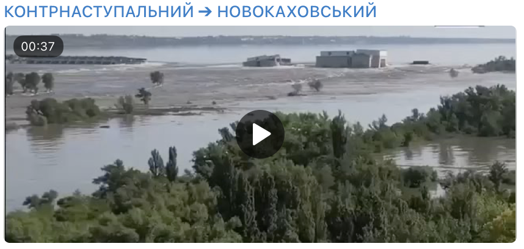

Source: [https://t.me/novokah/5273](https://t.me/novokah/5273) 

### 8 June 2023

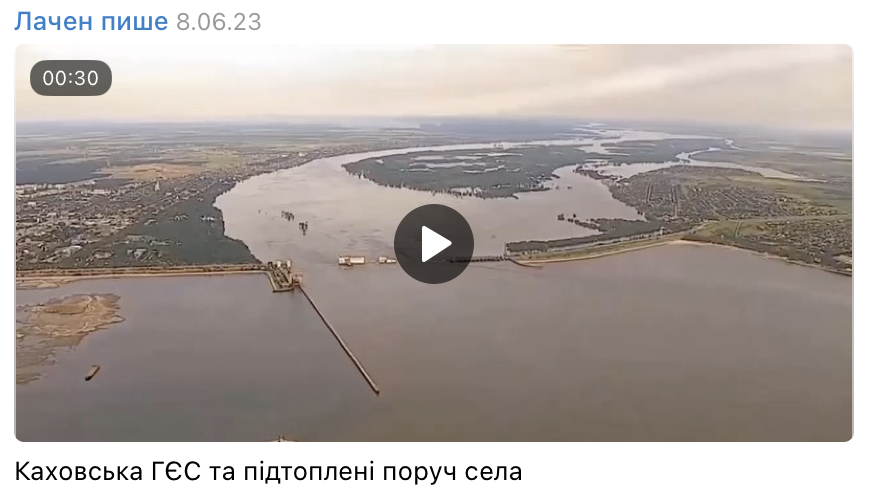

Source: [https://t.me/novokah/5382](https://t.me/novokah/5382) 

#### ~

Drone footage of the inside

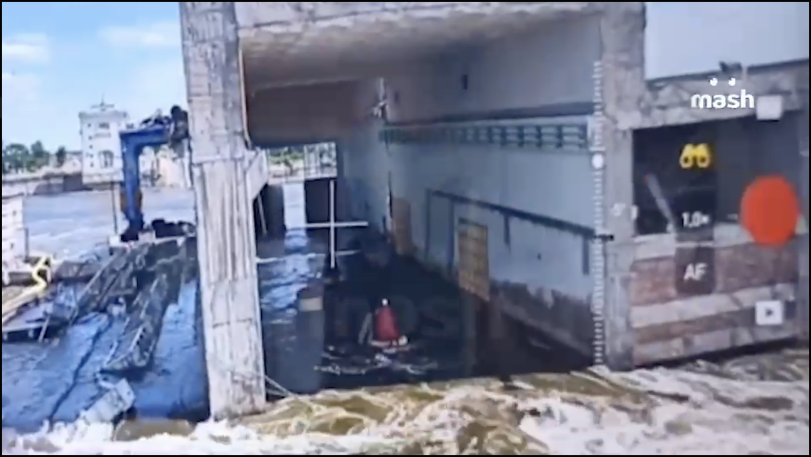

Source: [https://t.me/breakingmash/44814](https://t.me/breakingmash/44814)

### 10 June 2023

Source: [https://t.me/novokah/5421](https://t.me/novokah/5421) 

### 16 June 2023

Satellite by Maxar

Source: [https://twitter.com/cxemu/status/1669805342400602114](https://twitter.com/cxemu/status/1669805342400602114)

Notes:

1.  Seems like the last spillway we see above the water on this image is #13

### 23 June 2023

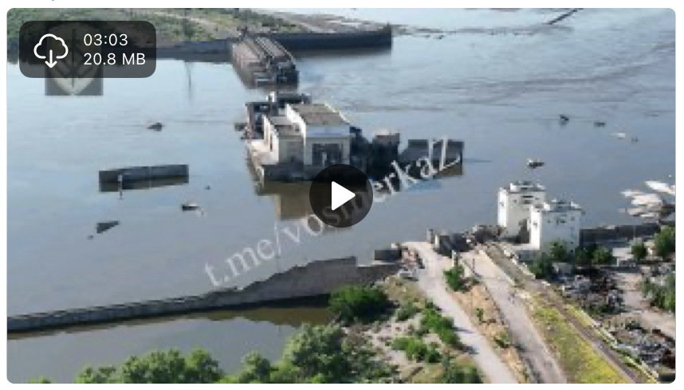

drone video

Source: [https://t.me/vosmerkaZ/107](https://t.me/vosmerkaZ/107) 

#### ~

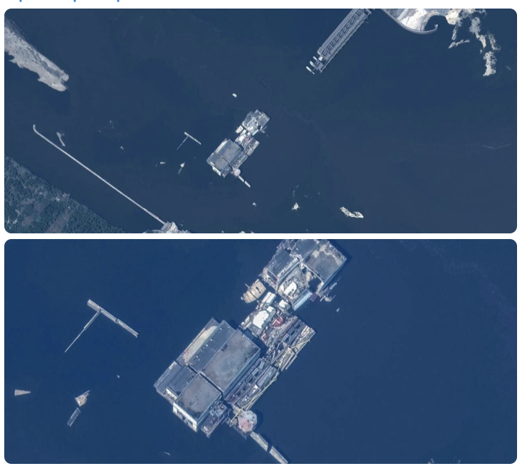

Source: [https://t.me/printerfort/5009](https://t.me/printerfort/5009) 

### 27 June 2023

Video

Source: [https://t.me/mostks/13275](https://t.me/mostks/13275)

### 29 June 2023

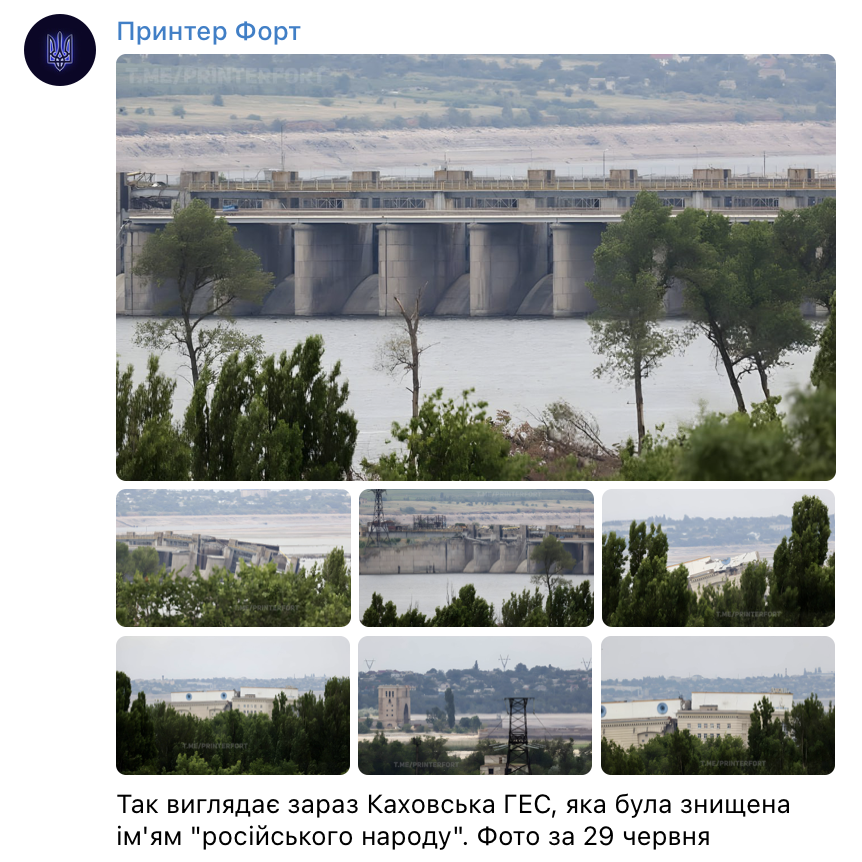

Source: [https://t.me/printerfort/5182](https://t.me/printerfort/5182) 

Explosion theory evidence and critics
-------------------------------------

### NYT article on barrage explosive demolition

Article: [https://www.nytimes.com/interactive/2023/06/16/world/europe/ukraine-kakhovka-dam-collapse.html](https://www.nytimes.com/interactive/2023/06/16/world/europe/ukraine-kakhovka-dam-collapse.html)

Tweet: [https://twitter.com/nytimes/status/1670441253094260737](https://twitter.com/nytimes/status/1670441253094260737) 

Зауваження до статті:

#### В статті не береться до уваги що є всі ознаки прогресуючої ерозії основи греблі

Експерти NYT кажуть що:

\> Neither this previous damage, nor the pressure caused by the high water level or the static position of the cranes is likely to have caused the collapse of the dam’s concrete foundation, experts said, unless the concrete was of low quality and already prone to deteriorate. The large flows would also be insufficient to undermine the dam’s foundation unless, for some reason, the concrete apron — the downstream cover placed over the river bottom — contained flaws or the soil was much softer than accounted for in the design.

Але ознаки ерозії рисберми та водобою в статті NYT не розглядають.

#### Затоплення частини водозливної греблі

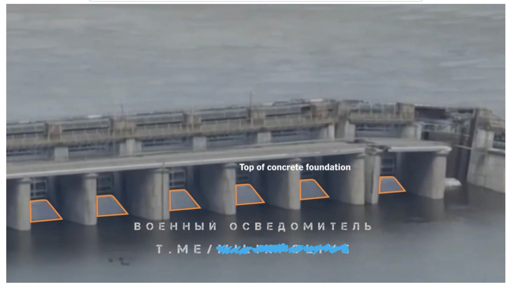

[https://t.me/milinfolive/102188](https://t.me/milinfolive/102188) — video that NYT article uses

NYT вказує на те що оскільки не видно верхівки водозливної греблі — то це означає що її підірвали.

Хоча з опублікованих ними ж кадрів видно що греблю викривило-зломало донизу (малюнок нижче). Не вниз за течією, а донизу. Нагадаю що гребля стоїть на піщаному дні, і їй нема куди вигинатися, якщо дно не підмито.

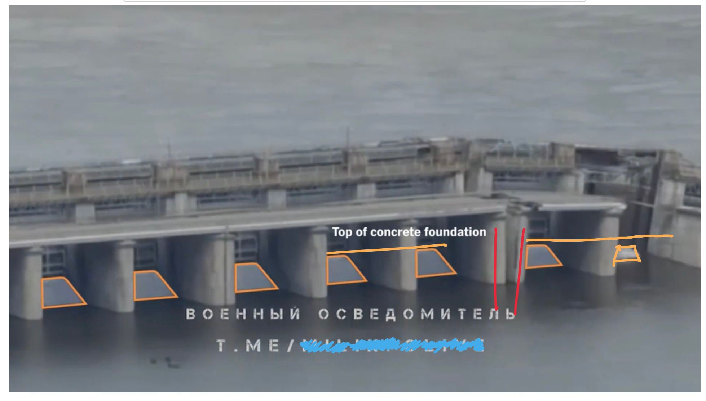

Якщо ми берем підрив за основну теорію прориву дамби — то спочатку міг бути підрив, потім підмив, потім падіння греблі. Якщо ми берем за основу теорію підмиву дамби — то греблю могло підмити, і тоді вона переломилась під власною вагою.

Мій аргумент такий що цим зламом неможливо довести підрив. Водозливну греблю прогнуло донизу, це сталося після підмиву дна. Як стався підмив дна поки невідомо.

Інший ракурс, щоб показати що це не вигин за течією, а вигін вниз до дна:

^ photos from [https://twitter.com/cxemu/status/1669805342400602114](https://twitter.com/cxemu/status/1669805342400602114) 

And we know that after the initial breach — there was some scouring under the constructions:

[Over/\_\\Drive](https://twitter.com/DraftnDepth) [@DraftnDepth](https://twitter.com/DraftnDepth)

\> Here is a screen shot showing that the whole turbine hall now is 4-5m below the road level (much better visible in the video) and even below the water level. The turbine hall sitting on a massive foundation is still more or less intact, but below it the sand was washed away. 7/x

[https://twitter.com/DraftnDepth/status/1666797145364787200](https://twitter.com/DraftnDepth/status/1666797145364787200) 

#### Satellite detecting explosions at or near the dam

\> just before the dam gave way, American intelligence satellites captured infrared heat signals that also indicated an explosion.

How precise is the measurement, where exactly it was detected, how strong was the explosion, when exactly did it happen? We have no hard data on this, just the claims of some U.S. officials.

We also have this FIRMS fire detection (likewise, not sure about the accuracy) :

Source: [https://twitter.com/EliotHiggins/status/1667107566617341956](https://twitter.com/EliotHiggins/status/1667107566617341956)

TODO: get data on the accuracy

### Seismic activity

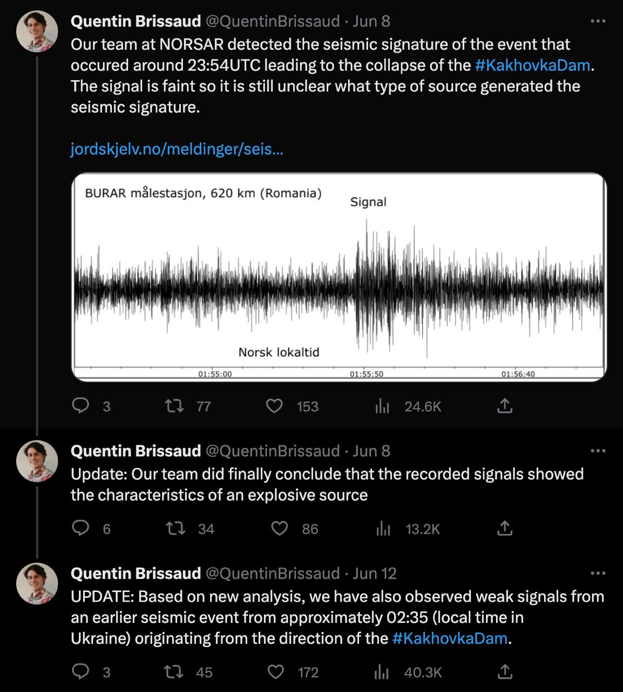

Source: [https://twitter.com/QuentinBrissaud/status/1666791591741210624](https://twitter.com/QuentinBrissaud/status/1666791591741210624)

Notes:

*   Local chats report “explosive” sounds at around 2:18 local time (not 02:35)
*   It is not clear if 21 meters high and 46 meters wide reinforced concrete barrage break and fall under the water could cause similar seismic signals. We also know that the HPP building failed separately, after the main breach in the barrage. Could that cause the first and the second “explosion” signal?
*   Location precision and force of the explosions detected by the seismic sensors are unknown and are not verified by other teams.
*   Could the flowing mines or artillery duels cause similar signals?
*   It would be interesting to compare that signal strength to other explosions in the area, like:

*   FAB on 1 June 2023: [Російська армія з авіації вдарила по Бериславу, Козацькому та Новій Каховці: що відомо](https://suspilne.media/493903-rosijska-armia-z-aviacii-vdarila-po-berislavu-kozackomu-ta-novij-kahovci/)
*   Or bigger ones like detonation of an ammo storage facility on 11 July 2022: [https://www.youtube.com/watch?v=YMc2cUzEZaw](https://www.youtube.com/watch?v=YMc2cUzEZaw) 

TODO: потрібні консультації з експертами щоб показати могло чи не могло перелом-падіння греблі викликати сейсмічні коливання.

### Car with explosives on the dam

19 June 2023: AP published [an article](https://twitter.com/AP/status/1670553785255485440) with drone footage of a car, loaded with explosives.

The issue is that the car is standing there after the dam breach of June 2023. It stood there since at least [28 April 2023](#h.2kn7qrssjcjt).

Though it is yet another proof that russsia thought that integrity of the dam is less important than stopping UA forces from crossing the dam.

EDIT: AP has updated the article to confirm that the car still stands on the dam, and didn’t cause the breach.

### Allegedly intercepted russian transmission near the dam, around the time of the breach

The source is claimed to be from ZSU. Quoting the interception (my translation attempt):

02:20 – Как обстановка? Это раз, во-вторых, в готовности, в готовности, всё по команде, как принял меня?

02:20 – How is the situation? That’s firstly, secondly, get ready, get ready, everything on command, did you read me?

02:20 – Тут все уже, все, пошло.

02:20 – It’s all done here, done, it’s going \[or “flowing”\].

02:21 – Принял тебя, принял, выдвигайтесь туда на точку, на точку, забирайте все.

02:21 – Roger that, roger that, move to the point, to the point, take everything with you.

02:21 – Та мы не сможем уже ничего забрать.

02:21 – But we won’t be able to take anything now.

02.30 – ЧП. Если что, тут все, точка отхода закончена, вода полная.

02.30 – Emergency. If you wonder, it’s all done here, point of retreat is done, water is full.

02.34 – Выдвигайтесь туда, где вас забирали и оставляли.

02.34 – Move out to the point where you were deployed and evacuated.

02.34 – Выйти не могут, все затоплено.

02.34 – They can’t exit, everything is flooded.

Source: me on [https://twitter.com/kddsky/status/1674149635345006592](https://twitter.com/kddsky/status/1674149635345006592)

At the moment it’s impossible to verify if this is authentic and if it is related to the dam breach. It is not clear what was happening by the context of the dialogue.

### Andrew Barr’s thread on Kakhovka Dam

Diving deep into explosive demolition version:

Source: [https://twitter.com/andrew\_barr/status/1668979717989335042](https://twitter.com/andrew_barr/status/1668979717989335042) 

A thread on why it was explosion with a subthread on how it could be scouring:

Source: [https://twitter.com/andrew\_barr/status/1671138072380014593](https://twitter.com/andrew_barr/status/1671138072380014593) 

Consequences
------------

TODO: Should this section exist?

Too huge a topic to cover. Ukraine’s civic population and ecology of the region suffered the most. Both russian and ZSU’s positions suffered. It’s unclear whether this had any influence on UA counteroffensive, but it definitely could. In a positive or in a negative way — hard to say.

Appendix
--------

Here I collected all useful and not links and photos that might be needed later.

### Useful links

ОСНОВЫ ГИДРОТЕХНИКИ - БЕТОННЫЕ ПЛОТИНЫ

[https://leg.co.ua/arhiv/generaciya/osnovy-gidrotehniki-9.html](https://leg.co.ua/arhiv/generaciya/osnovy-gidrotehniki-9.html) 

SPECIAL KHERSON CAT thread on Kakhovka Dam

[https://twitter.com/bayraktar\_1love/status/1563180256160231426](https://twitter.com/bayraktar_1love/status/1563180256160231426) 

### Other materials

#### Dam drone footage before the war, upstream

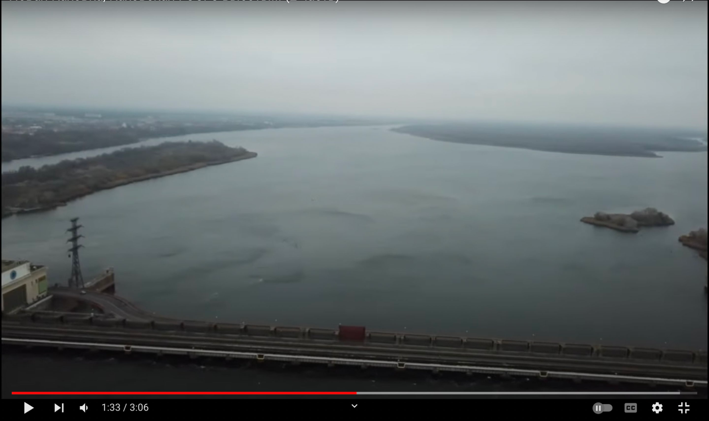

Part 1: [https://www.youtube.com/watch?v=\_9BB4QJBa-w&t=0s](https://www.youtube.com/watch?v=_9BB4QJBa-w&t=0s)

Part 2: [https://www.youtube.com/watch?v=lQf-QazJGBQ&t=93s](https://www.youtube.com/watch?v=lQf-QazJGBQ&t=93s)

#### Brigade fixing road over the lock < Jul 2022

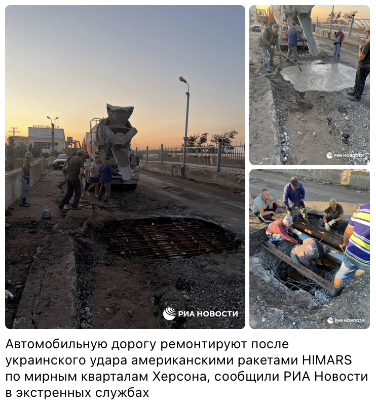

Source: [https://t.me/rian\_ru/172081](https://t.me/rian_ru/172081)

#### ~ 10 Aug 2022

Probably under the lock bridge:

Source: [https://t.me/supernova\_plus/8747](https://t.me/supernova_plus/8747) 

For reference under the lock bridge photo, from before the occupation times:

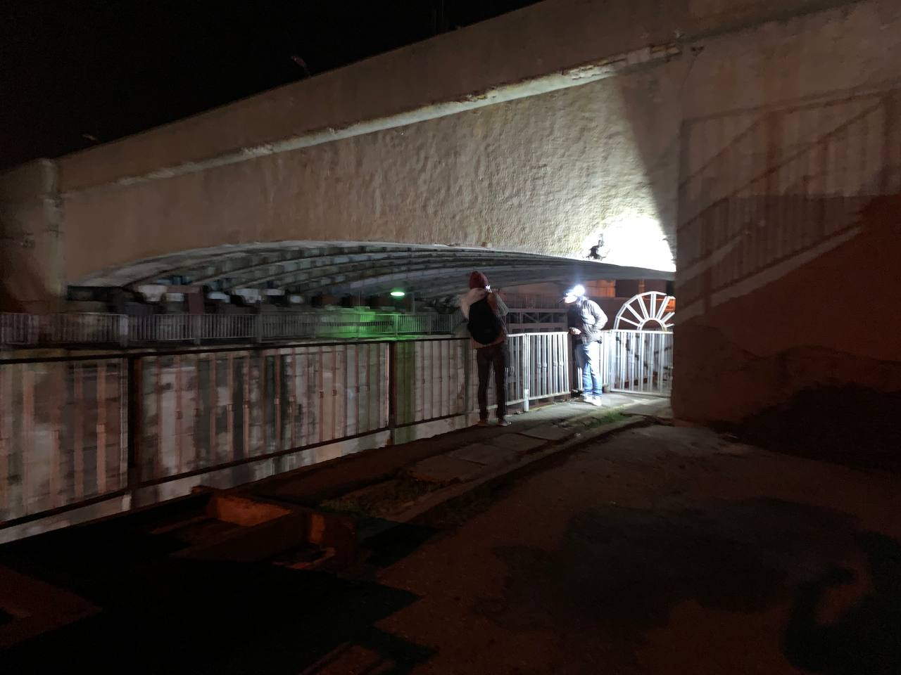

Source: [https://t.me/novokah/5301](https://t.me/novokah/5301)

#### Sep 02 confirmation of Lock and s-bridge hits

Source: [https://twitter.com/ArtisanalAPT/status/1566141350910824448/photo/1](https://twitter.com/ArtisanalAPT/status/1566141350910824448/photo/1) 

#### 02 Sep 2022 — Lock bridge damage

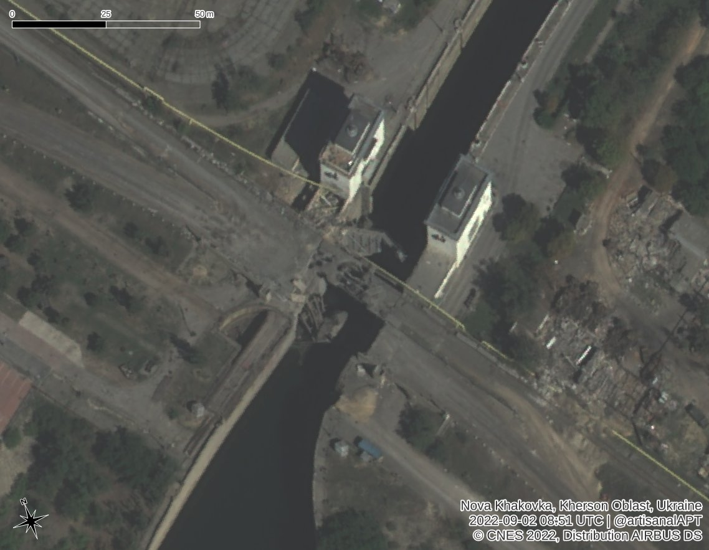

Source: [https://twitter.com/ArtisanalAPT/status/1567270449226072066/photo/1](https://twitter.com/ArtisanalAPT/status/1567270449226072066/photo/1)

### Reference photos

#### 2020-06-05 .. 2023-06-28 Gif

Sentinel Hub satellite images for three years before the breach

Source: [https://sentinelshare.page.link/aNAf](https://sentinelshare.page.link/aNAf)

Same but for 2016-2023: [https://sentinelshare.page.link/qENV](https://sentinelshare.page.link/qENV) 

Video for 2016-2023: [https://www.youtube.com/watch?v=musf2s0ZfQ4](https://www.youtube.com/watch?v=musf2s0ZfQ4) 

#### Open gates ~ 2013

opened-closed-opened pattern, symmetrical gates opened

Source: [https://uk.wikipedia.org/wiki/%D0%A4%D0%B0%D0%B9%D0%BB:NK-GES-Plotina\_2013.jpg](https://uk.wikipedia.org/wiki/%D0%A4%D0%B0%D0%B9%D0%BB:NK-GES-Plotina_2013.jpg) 

#### Gates opening in 2018

##### 10-04-2018 — Two opened + HPP

Draining water, opened-closed-opened pattern, gates opened symmetrically to HPP

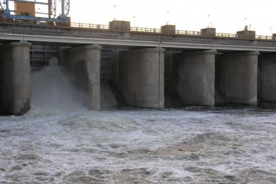

Source: [https://uhe.gov.ua/media\_tsentr/novyny/na-kakhovskiy-ges-vidkrili-zatvori-dlya-propusku-vodi](https://uhe.gov.ua/media_tsentr/novyny/na-kakhovskiy-ges-vidkrili-zatvori-dlya-propusku-vodi)

##### 11-04-2018 — 4 opened + HPP

Draining water, opened-closed-opened pattern, symmetrical opened gates layout

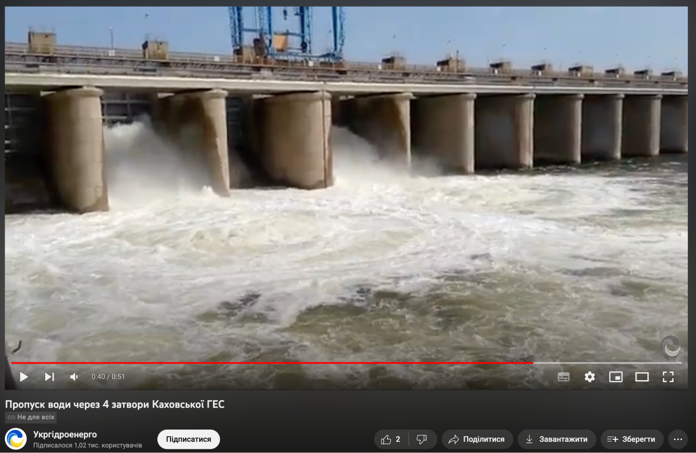

Source: [https://uhe.gov.ua/media\_tsentr/novyny/na-kahovskii-ges-vidkrito-4-zatvori-dla-propusku-vodi](https://uhe.gov.ua/media_tsentr/novyny/na-kahovskii-ges-vidkrito-4-zatvori-dla-propusku-vodi) 

Source: [https://www.youtube.com/watch?v=Y0ekG1NFgEU](https://www.youtube.com/watch?v=Y0ekG1NFgEU) 

Note:

*   this was seen from the satellite [https://youtu.be/musf2s0ZfQ4?t=10](https://youtu.be/musf2s0ZfQ4?t=10) 

##### 14 April 2018 — 6 opened + HPP

Draining water, opened-closed-opened pattern, gates opened symmetrically to HPP

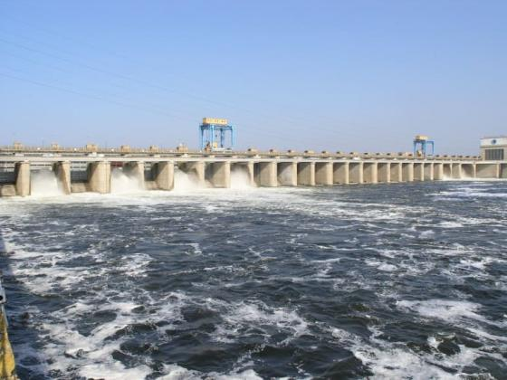

Source: [https://uhe.gov.ua/media\_tsentr/novyny/na-kahovskii-ges-vidkrito-6-zatvoriv-dla-propusku-vodi](https://uhe.gov.ua/media_tsentr/novyny/na-kahovskii-ges-vidkrito-6-zatvoriv-dla-propusku-vodi)

#### HPP from upstream

Source: [https://twitter.com/osintjourno/status/1672910197457813504/photo/1](https://twitter.com/osintjourno/status/1672910197457813504/photo/1) 

#### HPP from left bank, upstream

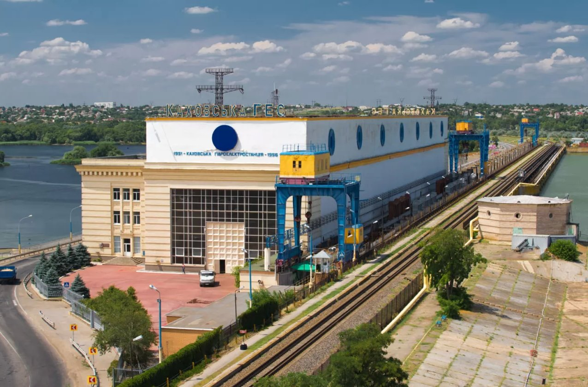

Source: [https://twitter.com/osintjourno/status/1672907726886948866/photo/1](https://twitter.com/osintjourno/status/1672907726886948866/photo/1) 

#### HPP crane other side

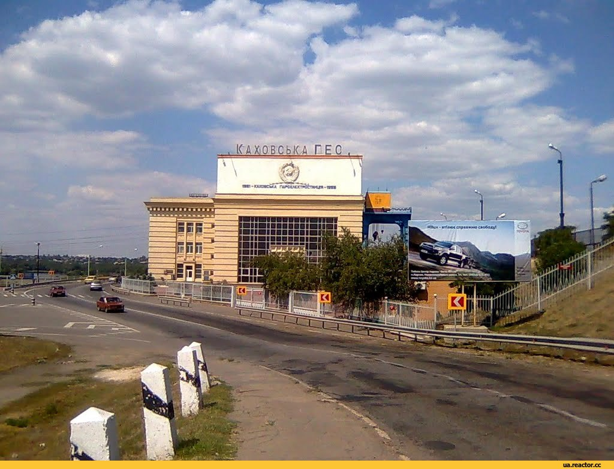

Source: [https://uatalks.com/showthread.php?432-%D0%9D%D0%BE%D0%B2%D0%B0-%D0%9A%D0%B0%D1%85%D0%BE%D0%B2%D0%BA%D0%B0](https://uatalks.com/showthread.php?432-%D0%9D%D0%BE%D0%B2%D0%B0-%D0%9A%D0%B0%D1%85%D0%BE%D0%B2%D0%BA%D0%B0)

#### ~

Source: [https://www.instagram.com/p/CFgqKfch\_yr/](https://www.instagram.com/p/CFgqKfch_yr/)

#### Cranes up-close

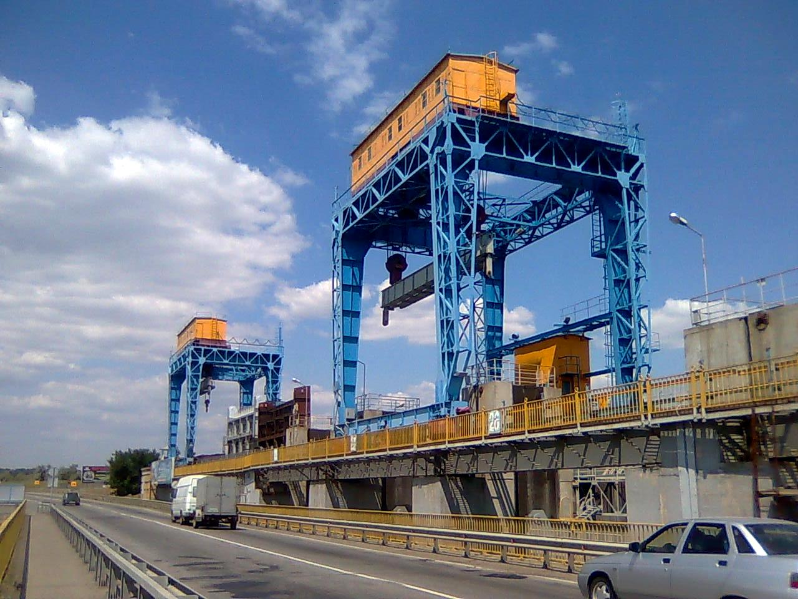

Source: [https://twitter.com/osintjourno/status/1672907229891301378/photo/1](https://twitter.com/osintjourno/status/1672907229891301378/photo/1)

### russian positions on the dam

#### Names

List of russians, who were based on the dam:

[https://www.slidstvo.info/warnews/v-yty-ne-mohut-vse-zatopleno-pro-shcho-hovoryly-okupanty-pid-chas-pidryvu-kakhovskoi-hes-telefonni-perekhoplennia/](https://www.slidstvo.info/warnews/v-yty-ne-mohut-vse-zatopleno-pro-shcho-hovoryly-okupanty-pid-chas-pidryvu-kakhovskoi-hes-telefonni-perekhoplennia/)

#### Photos from the site

Source: [https://t.me/Separ13\_13/14011](https://t.me/Separ13_13/14011) (ru propaganda)

Source: [https://twitter.com/osintjourno/status/1674393815765884931/photo/3](https://twitter.com/osintjourno/status/1674393815765884931/photo/3) 

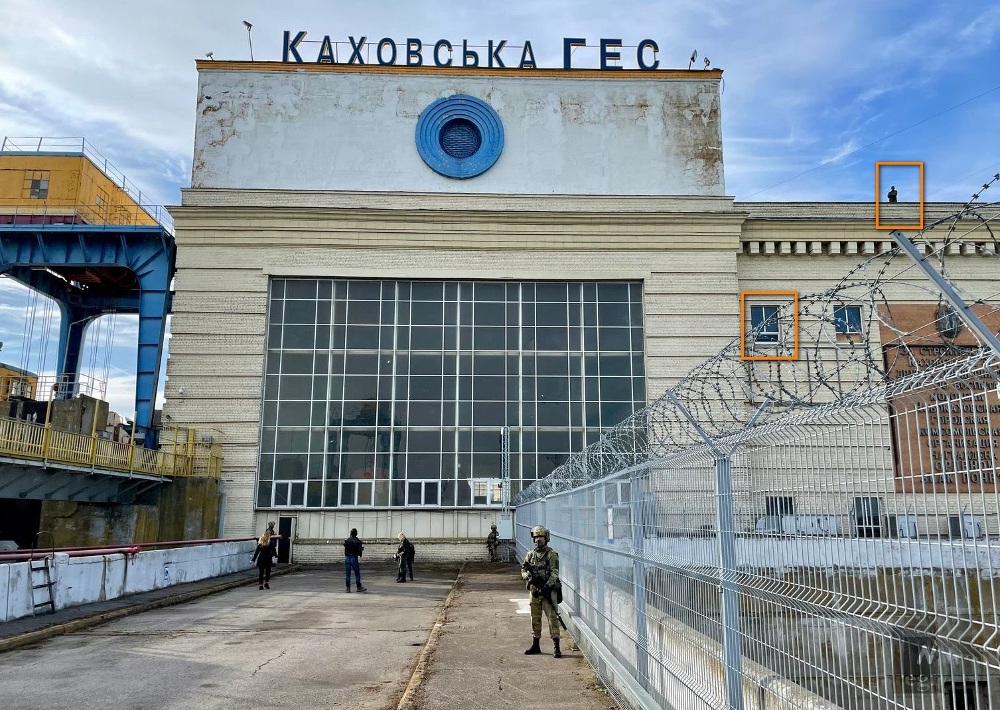

Source: [https://twitter.com/osintjourno/status/1674340602429702149/photo/1](https://twitter.com/osintjourno/status/1674340602429702149/photo/1)

#### 17 Aug 2022

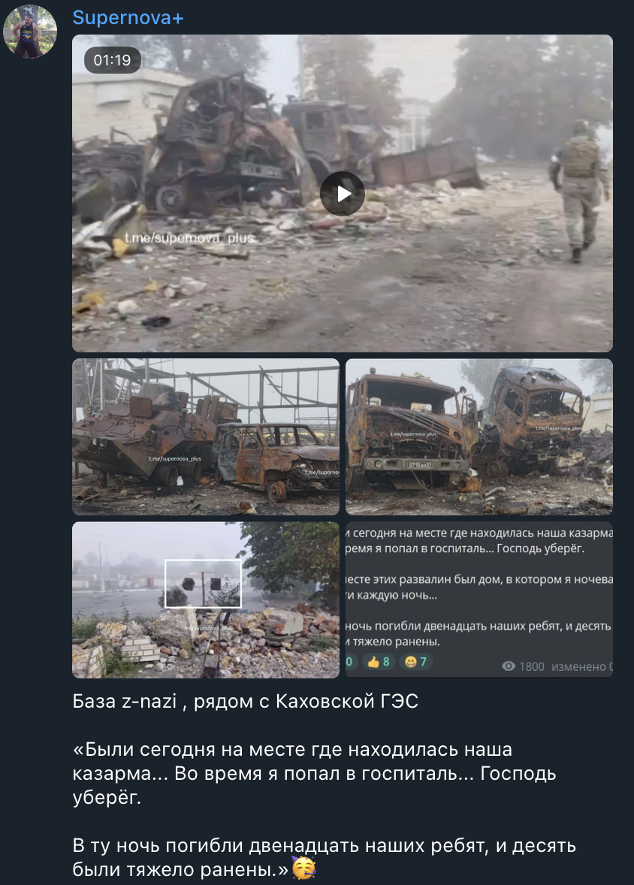

Source: [https://t.me/supernova\_plus/9109](https://t.me/supernova_plus/9109)

Source: [https://t.me/Separ13\_13/3190](https://t.me/Separ13_13/3190) (ru propaganda)

#### Position on the bottom of the river — unconfirmed

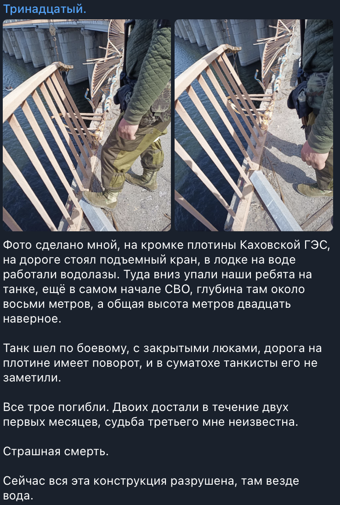

Source: [https://t.me/Separ13\_13/15118](https://t.me/Separ13_13/15118) (ru propaganda)

#### 25 March 2022 — inside HPP

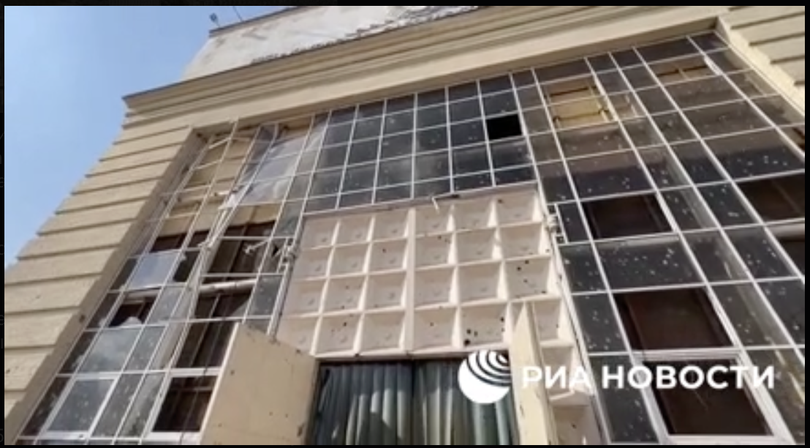

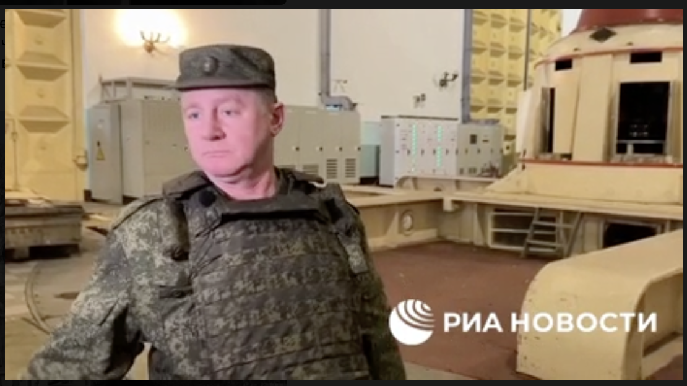

Source: [https://t.me/rian\_ru/197953](https://t.me/rian_ru/197953) (ru propaganda)

Note:

*   Some noise can be heard on the background. It might indicate that the water is still flowing through the turbines.

### Historic photos

\> В 1956 г. была введена в эксплуатацию на полную мощность нижняя ступень Днепровского каскада — Каховская ГЭС с водохранилищем полезным объемом 6,8 млрд. М3.

Source: [https://leg.co.ua/arhiv/generaciya/gidroenergetika-sssr/Page-4.html](https://leg.co.ua/arhiv/generaciya/gidroenergetika-sssr/Page-4.html)

#### Waterspill barrage and apron

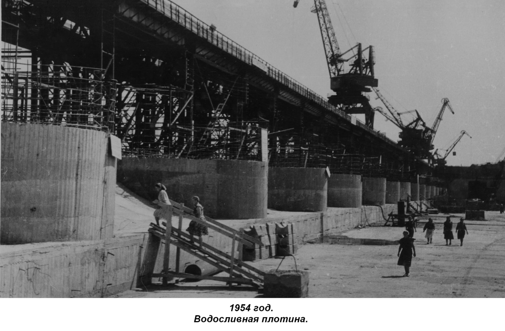

Source: [https://uhe.gov.ua/sites/default/files/2018-09/6.JPG](https://uhe.gov.ua/sites/default/files/2018-09/6.JPG)

#### Barrage and stilling basin

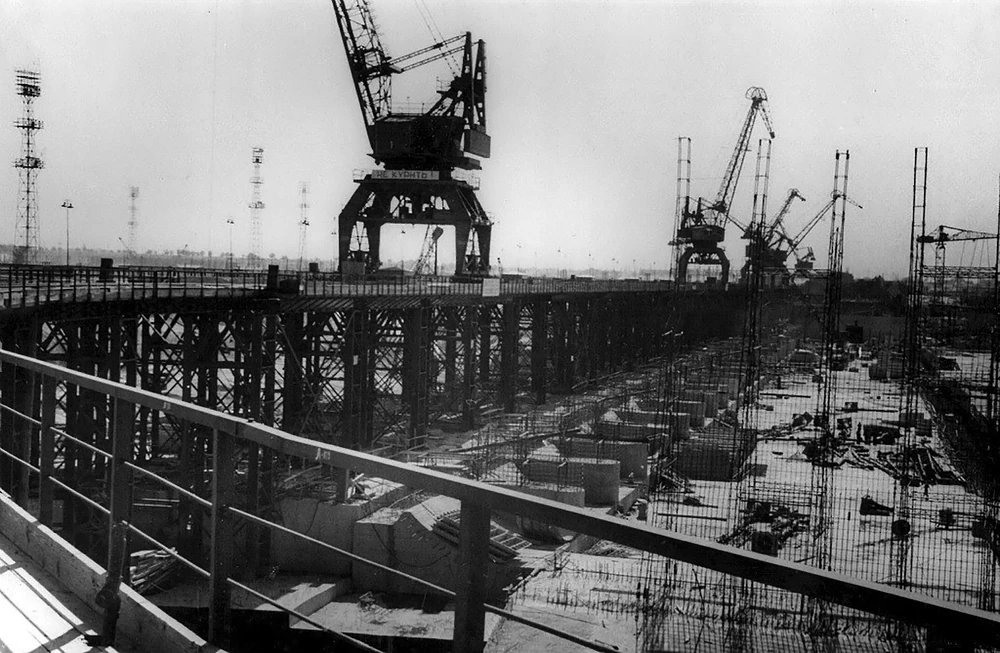

Source: [https://novakahovka.fandom.com/uk/wiki/%D0%9A%D0%B0%D1%85%D0%BE%D0%B2%D1%81%D1%8C%D0%BA%D0%B0\_%D0%93%D0%95%D0%A1?file=%D0%91%D1%83%D0%B4%D1%96%D0%B2%D0%BD%D0%B8%D1%86%D1%82%D0%B2%D0%BE\_%D0%9D%D0%BE%D0%B2%D0%BE%D0%BA%D0%B0%D1%85%D0%BE%D0%B2%D1%81%D1%8C%D0%BA%D0%BE%D1%97\_%D0%93%D0%95%D0%A1.jpeg](https://novakahovka.fandom.com/uk/wiki/%D0%9A%D0%B0%D1%85%D0%BE%D0%B2%D1%81%D1%8C%D0%BA%D0%B0_%D0%93%D0%95%D0%A1?file=%D0%91%D1%83%D0%B4%D1%96%D0%B2%D0%BD%D0%B8%D1%86%D1%82%D0%B2%D0%BE_%D0%9D%D0%BE%D0%B2%D0%BE%D0%BA%D0%B0%D1%85%D0%BE%D0%B2%D1%81%D1%8C%D0%BA%D0%BE%D1%97_%D0%93%D0%95%D0%A1.jpeg)

#### Stilling basin and the separator-wall

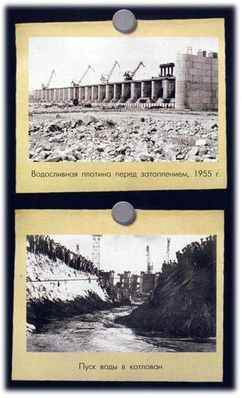

On the top photo we can see the tip of the wall, that would fall some month before the catastrophe.

[http://mycity.kherson.ua/organiz/hersonoblenergo/k-gidroe.html](http://mycity.kherson.ua/organiz/hersonoblenergo/k-gidroe.html) 

ІСТОРІЯ БУДІВНИЦТВА

[https://uhe.gov.ua/filiyi/kakhovska\_hes\_imeni\_p\_s\_neporozhnoho](https://uhe.gov.ua/filiyi/kakhovska_hes_imeni_p_s_neporozhnoho)

Каховська ГЕС

[https://novakahovka.fandom.com/uk/wiki/%D0%9A%D0%B0%D1%85%D0%BE%D0%B2%D1%81%D1%8C%D0%BA%D0%B0\_%D0%93%D0%95%D0%A1](https://novakahovka.fandom.com/uk/wiki/%D0%9A%D0%B0%D1%85%D0%BE%D0%B2%D1%81%D1%8C%D0%BA%D0%B0_%D0%93%D0%95%D0%A1)

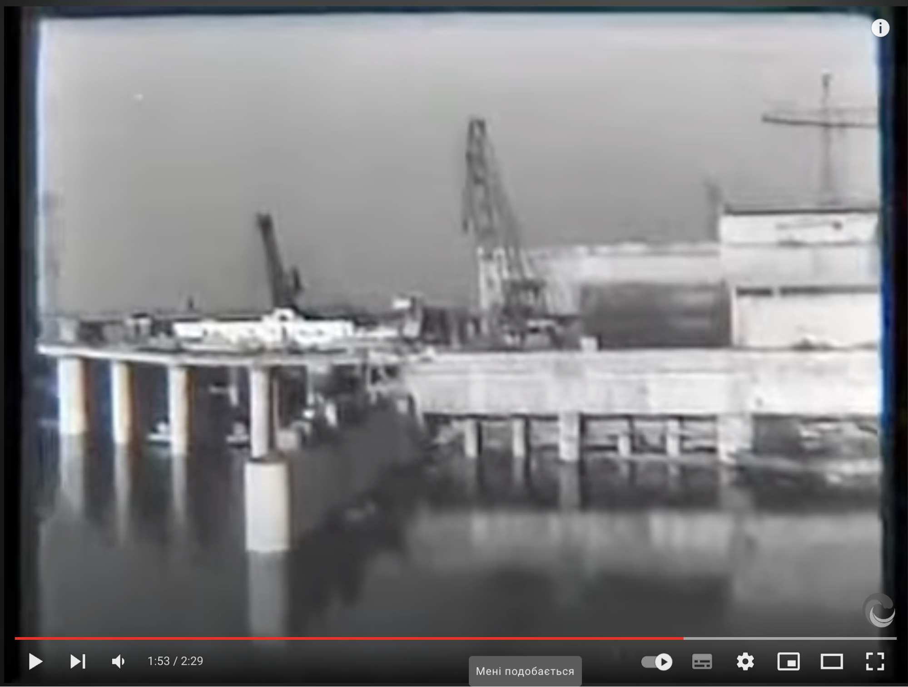

Source: [https://www.youtube.com/watch?v=M89NRCoMsfk](https://www.youtube.com/watch?v=M89NRCoMsfk) 

Source: [https://www.youtube.com/watch?v=7fzzGmgh5ZM](https://www.youtube.com/watch?v=7fzzGmgh5ZM) 

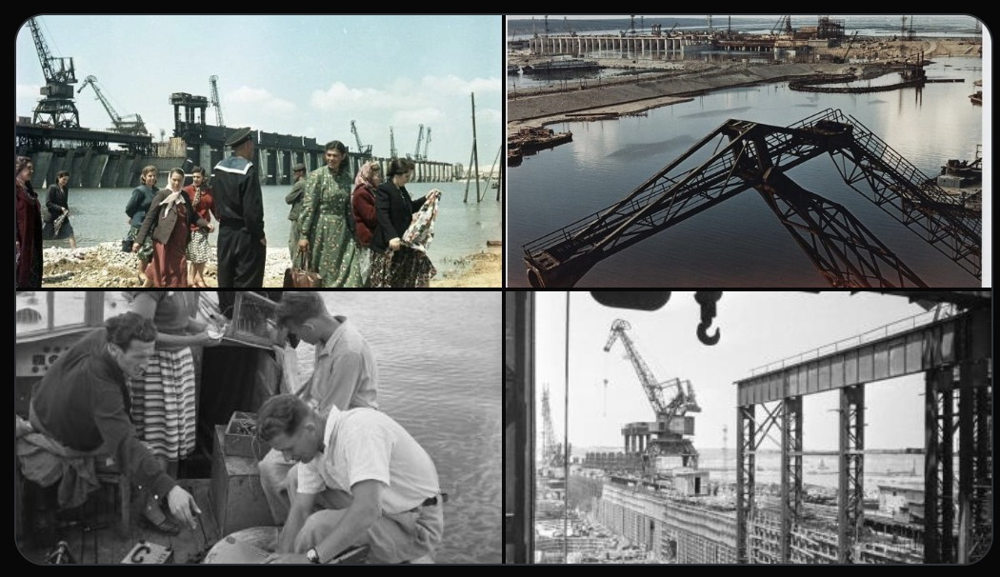

Source: [https://twitter.com/osintjourno/status/1675907031880937488](https://twitter.com/osintjourno/status/1675907031880937488) 

Перші версії плану побудови греблі (невалідні — ГЕС з іншої сторони, інше викривлення греблі)

[https://static.wikia.nocookie.net/novakahovka/images/9/95/%D0%9F%D0%BB%D0%B0%D0%BD\_%D0%9D%D0%BE%D0%B2%D0%BE%D1%97\_%D0%9A%D0%B0%D1%85%D0%BE%D0%B2%D0%BA%D0%B8\_%D1%82%D0%B0\_%D0%93%D0%95%D0%A1.jpg/revision/latest?cb=20210819103550&path-prefix=uk](https://static.wikia.nocookie.net/novakahovka/images/9/95/%D0%9F%D0%BB%D0%B0%D0%BD_%D0%9D%D0%BE%D0%B2%D0%BE%D1%97_%D0%9A%D0%B0%D1%85%D0%BE%D0%B2%D0%BA%D0%B8_%D1%82%D0%B0_%D0%93%D0%95%D0%A1.jpg/revision/latest?cb=20210819103550&path-prefix=uk) з статті  [https://novakahovka.fandom.com/uk/wiki/%D0%86%D1%81%D1%82%D0%BE%D1%80%D1%96%D1%8F\_%D0%9D%D0%BE%D0%B2%D0%BE%D1%97\_%D0%9A%D0%B0%D1%85%D0%BE%D0%B2%D0%BA%D0%B8](https://novakahovka.fandom.com/uk/wiki/%D0%86%D1%81%D1%82%D0%BE%D1%80%D1%96%D1%8F_%D0%9D%D0%BE%D0%B2%D0%BE%D1%97_%D0%9A%D0%B0%D1%85%D0%BE%D0%B2%D0%BA%D0%B8) 

1943 Dnipro river state [https://twitter.com/tom\_bike/status/1668306000544165888/photo/1](https://twitter.com/tom_bike/status/1668306000544165888/photo/1) 

Source: [https://youtu.be/FAokWR1knJY?t=157](https://youtu.be/FAokWR1knJY?t=157)

Other photos:

[http://mycity.kherson.ua/gallery/thumbnails.php?album=134](http://mycity.kherson.ua/gallery/thumbnails.php?album=134)

~ The End ~
-----------

Contact me: [Kos Palchyk](https://twitter.com/kddsky)

[#StandWithUkraine](https://twitter.com/hashtag/StandWithUkraine) [#RussiaIsATerroristState](https://twitter.com/hashtag/RussiaIsATerroristState)